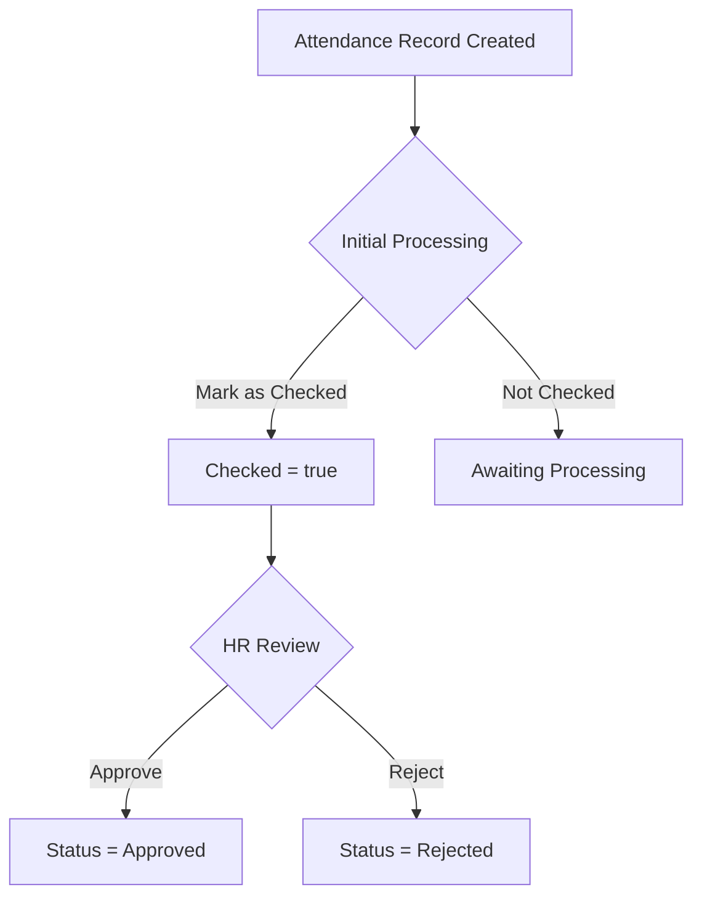
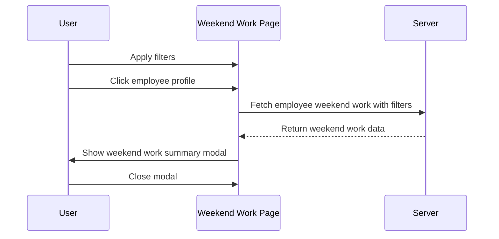

# Unified Attendance & Weekend Work Processing and Approval Plan

---

## Overview

This document outlines the unified approach for managing **all employee attendance records**, including **weekend work**, with a two-stage process:
- **Initial Processing ("Checked" flag)**
- **HR Approval (Pending, Approved, Rejected)**

It also integrates the weekend work employee summary feature for a streamlined experience.

---

## Core Features

### Attendance Records
- View employee clock-in and clock-out times.
- Filter by date range, department, employee.
- Track total hours worked.
- Add HR notes to attendance records.
- **Checked flag (boolean):** indicates initial processing completed.
- **Approval status:** Pending, Approved, Rejected (managed by HR).
- Weekend work records are a **subset** of attendance records, with special filters and summaries.

---

## Processing & Approval Workflow

| Step | Status/Flag | Description |
|-------|-------------|-------------|
| 1     | **Checked** (boolean) | Attendance record is initially reviewed/processed by payroll/admin. |
| 2     | **Approval Status** (Pending/Approved/Rejected) | HR reviews and finalizes the record. |

- "Checked" is **independent** of approval status.
- HR approval **may be restricted** until "Checked" is true (optional enforcement).

---

## Workflow Diagram

---

## Weekend Work Employee Summary

### Objective
Provide detailed weekend work info per employee, respecting active filters.

### User Flow
1. User applies filters (date range, department, etc.).
2. User clicks an employee profile.
3. Modal/dialog opens showing:
   - Employee's weekend work matching filters.
   - Data displayed per day.
4. User closes modal to return.

### UI Components
- **Clickable Employee Element**
- **Weekend Work Summary Modal**
  - Title: Employee + "Weekend Work Summary"
  - Columns: Date, Weekend Work (Yes/No), Hours, Notes
  - Close button

### Data Handling
- Filters applied to API request.
- Endpoint: `/api/weekend-work/employee/{employee_id}/?start_date=...&end_date=...&department=...`
- Populate modal with response.

### Accessibility
- Trap focus inside modal.
- Return focus on close.
- Use semantic HTML and ARIA roles.

### Sequence Diagram

---

## API Endpoints

### `/attendance/`
- **GET** attendance records.
- **Query Parameters:**
  - `start_date`, `end_date`
  - `department`
  - `employee_id`
  - `checked` (true/false)
  - `approval_status` (pending, approved, rejected)
- **Response Fields:**
  - ID, Employee, Date, Punch In/Out, Duration, Department
  - `checked` (boolean)
  - `approval_status`
  - HR notes

### `/attendance/weekend-work/`
- Same as above, filtered for weekend days.
- Additional filters for weekend-specific reports.

---

## User Interface Components

- **Date Range Picker**
- **Filters:** Department, employee, checked status, approval status
- **Summary Table:** Displays filtered data
- **Checked Indicator:** Checkbox or badge
- **Approval Actions:** Approve/Reject
- **Weekend Work Summary Modal**
- **Export Options:** PDF, Excel (planned)
- **Pagination/Search**

---

## Recent UI Enhancements (April 2025)

- The **Attendance List** now includes a dedicated **"Checked"** column with an inline toggle switch.
- The toggle allows immediate marking/unmarking of the "Checked" flag, updating the backend and UI instantly.
- **Approve** and **Reject** buttons have been added inline for each attendance record, enabling HR to update approval status directly from the list.
- The **HR Note** column has been moved to the **last** column position for clarity.
- These changes improve workflow efficiency by allowing inline updates without navigating away from the main attendance list.

---

## Future Enhancements

- Enforce "Checked" before HR approval.
- Audit logs for "Checked" and approval actions.
- Bulk "Check" processing.
- Overtime calculations.
- Export functionality.
- Performance optimizations.

---

## Last updated: April 10, 2025