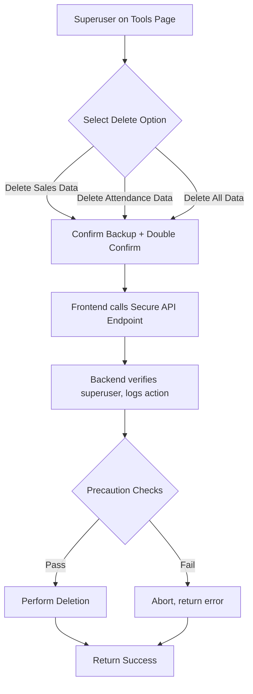
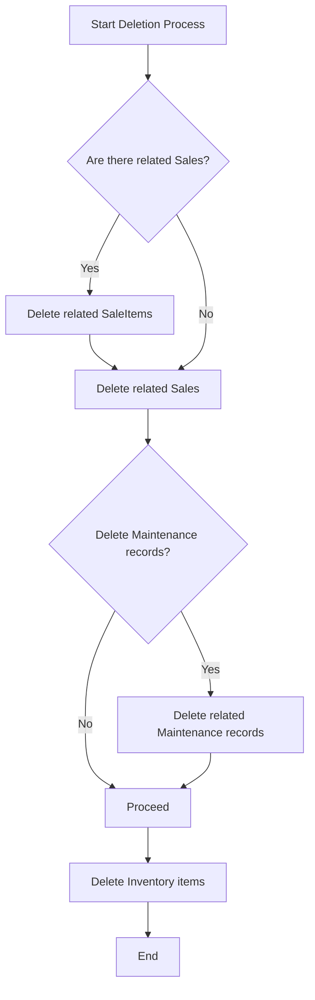

# 🗂️ IcePlant Portal — Database Management Tools Implementation Plan

## **Objectives**
- Add **superuser-only** tools on the Tools page to:
  - **Delete data per Django app/module** (e.g., sales, attendance)
  - **Delete all data** in the database
- Enforce **precautions**:
  - Require recent **backup confirmation**
  - **Double confirmation dialogs** in UI
  - **Log all deletions** (who, when, what)
- Update **backend API**, **frontend UI**, **migration/MC files**, and **documentation**

---

## **High-Level Architecture**



---

## **Step-by-Step Plan**

### 1. **Design API Endpoints**

- **Base URL:** `/api/admin-tools/`
- **Endpoints:**
  - `DELETE /api/admin-tools/delete-data/`
    - **Payload:**
      ```json
      {
        "scope": "sales" | "attendance" | "all",
        "backup_confirmed": true
      }
      ```
    - **Behavior:**
      - Require `backup_confirmed: true`
      - Check user is **superuser**
      - Log action (user, timestamp, scope)
      - Delete data accordingly
      - Return success or error

- **Security:**
  - Superuser-only permission
  - CSRF protection
  - Rate limiting (optional)

---

### 2. **Backend Implementation**

- **Create a new Django app** (optional) e.g., `admin_tools` or add to an existing core app.
- **Views:**
  - Use DRF `APIView` or `ViewSet` with `destroy` method
  - Implement logic to:
    - Verify `backup_confirmed`
    - Log deletion request (model: `DeletionLog`)
    - Call deletion functions per scope
- **Deletion functions:**
  - For each scope (`sales`, `attendance`, `all`), delete related models' data
  - Use Django ORM `.delete()` with care
  - Wrap in transaction for atomicity
- **Logging:**

---

### **Deletion Order Logic**

To avoid foreign key constraint errors (e.g., `ProtectedError`), deletions **must** follow this order:

1. **Delete Sales and SaleItems**
   - Identify all `Sale` records related to the Inventory items you want to delete.
   - Delete all `SaleItem` records referencing those Inventory items.
   - Delete the corresponding `Sale` records (if no other SaleItems remain).

2. **Delete Maintenance Records (Optional)**
   - Since no foreign key constraints exist, this is optional.
   - Recommended for data consistency if Maintenance conceptually depends on Inventory.

3. **Delete Inventory Items**
   - After clearing dependent records, delete the Inventory items.
   - This will now succeed without `ProtectedError`.

#### **Flowchart**



This order ensures safe, dependency-aware deletions.
  - Create `DeletionLog` model:
    ```python
    class DeletionLog(models.Model):
        user = models.ForeignKey(User, on_delete=models.CASCADE)
        scope = models.CharField(max_length=50)
        timestamp = models.DateTimeField(auto_now_add=True)
        details = models.TextField()
    ```
- **URLs:**
  - Register under `/api/admin-tools/`
- **Tests:**
  - Superuser access
  - Backup confirmation required
  - Correct data deletion
  - Logging works

---

### 3. **Frontend Implementation**

- **Create new component:** `DatabaseManagementTools.tsx`
- **Add to `ToolsPage.tsx`** alongside existing tools
- **UI Elements:**
  - **Dropdown or buttons** for:
    - Delete Sales Data
    - Delete Attendance Data
    - Delete All Data
  - **Backup confirmation checkbox**
  - **Double confirmation dialogs:**
    - "Are you sure?"
    - "This action is irreversible. Proceed?"
- **API Calls:**
  - Call `/api/admin-tools/delete-data/` with scope and backup confirmation
  - Show success/error notifications
- **Restrict visibility:**
  - Only show to **superusers**

---

### 4. **Precautions & Safety**

- **Require recent backup confirmation** (checkbox)
- **Double confirmation dialogs**
- **Log all deletions** with user, timestamp, scope
- **Wrap deletions in transactions** to avoid partial deletes
- **Optional:** Email notification to admin after deletion

---

### 5. **Update Migration/MC Files**

- **Create migration** for `DeletionLog` model
- **If needed, create management command** for CLI-based deletion (optional)
- **Document** the new API endpoints and usage in the MC file

---

### 6. **Documentation Updates**

- **README.md:**
  - Add section **"Database Management Tools"**
  - Explain:
    - How to use the Tools page for deletions
    - Precautions and backup requirements
    - API endpoint details
- **MIGRATION_PROTOCOL.md:**
  - Add instructions to run migrations for new models
- **TEST_DATA_PROTOCOL.md:**
  - Add notes on test data cleanup using new tools

---

### 7. **Testing & Validation**

- **Unit tests** for backend API
- **Integration tests** for frontend
- **Manual testing:**
  - Backup data
  - Delete per module
  - Delete all data
  - Check logs
  - Verify permissions

---

## **Summary Table**

| Step | Task | Owner | Notes |
|-------|------------------------------|--------|-----------------------------|
| 1     | Design API & models         | Backend| Secure, superuser-only      |
| 2     | Implement backend logic     | Backend| Logging, transactions       |
| 3     | Build frontend UI           | Frontend| Double confirmation, restrict|
| 4     | Add precautions             | Both   | Backup confirm, logs        |
| 5     | Update migrations/MC files  | Backend| New models, commands        |
| 6     | Update documentation        | Both   | README, protocols           |
| 7     | Testing                     | Both   | Unit, integration, manual   |