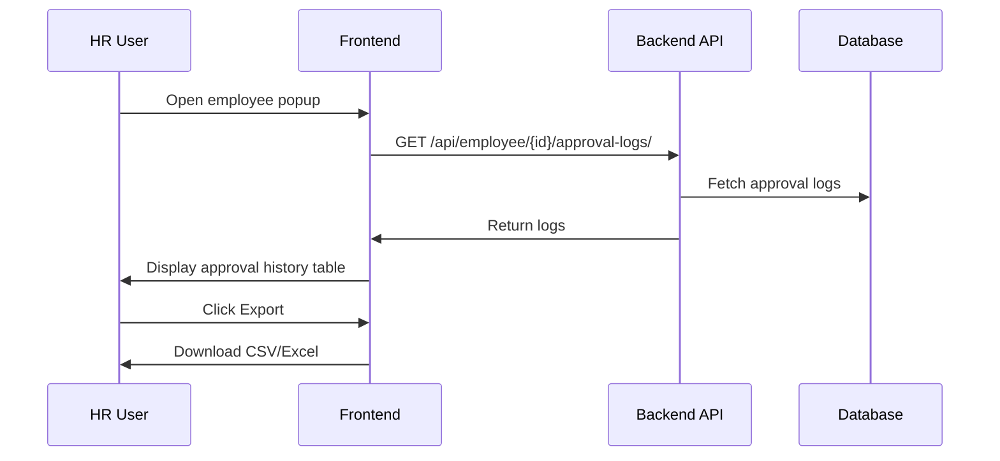

# HR Attendance Approval Log - Frontend Implementation Plan

---

## Overview

Enhance the **EmployeeAttendanceModal** to display a full **approval/rejection history** for each employee's attendance records, with export capability.

---

## UI Design

- Add a **new tab** or **expandable panel** labeled **"Approval History"** inside the employee popup.
- Display a **table** with columns:
  - **Date/Time**
  - **User**
  - **Status** (Approved/Rejected)
  - **Note**
- Add an **Export** button to download logs as CSV or Excel.

---

## Data Flow

- Fetch approval logs from API:
  - `/api/attendance/{attendance_id}/logs/`
  - or `/api/employee/{employee_id}/approval-logs/`
- Store logs in component state: `approvalLogs`.
- Fetch logs when:
  - Modal opens.
  - User selects a specific attendance record (optional).

---

## Component Changes

- **State:**
  - `approvalLogs: ApprovalLog[]`
  - `loadingLogs: boolean`
- **Fetch logs:**
  - Use `useEffect` on modal open or record select.
  - Call API, set `approvalLogs`.
- **Render:**
  - Table with columns Date, User, Status, Note.
  - Export button.

---

## API Response Example

```json
[
  {
    "id": 1,
    "timestamp": "2025-04-10T12:34:56Z",
    "user": "hr_manager",
    "new_status": "approved",
    "note": "Approved after verification"
  },
  {
    "id": 2,
    "timestamp": "2025-04-09T09:15:00Z",
    "user": "hr_manager",
    "new_status": "rejected",
    "note": "Missing check-out"
  }
]
```

---

## Export Functionality

- Convert `approvalLogs` to CSV or Excel.
- Include columns: Date, User, Status, Note.
- Trigger download on button click.

---

## Mermaid Diagram



---

## Summary

- Approval history visible in employee popup.
- Full audit trail of status changes with reasons.
- Exportable for reporting.
- Enhances transparency and compliance.

---

## Last Updated

April 10, 2025