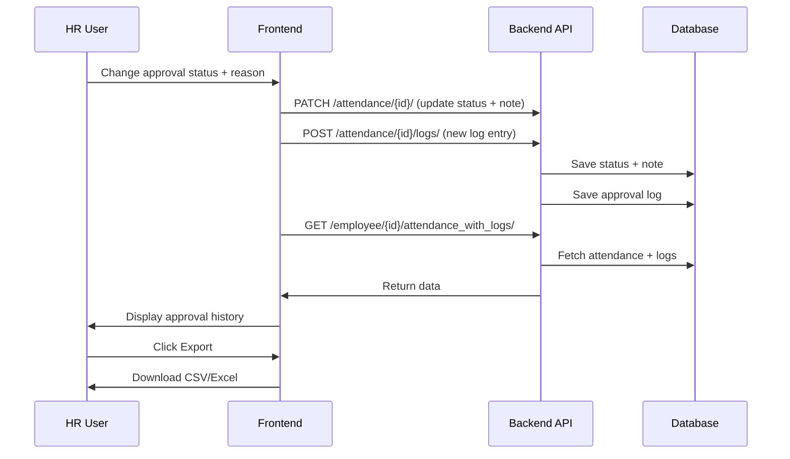

# HR Attendance Approval Log & Export Plan

---

## Overview

Maintain a full audit trail of all HR approval and rejection actions on attendance records, including reasons. Display this log in the employee profile popup and allow exporting it.

---

## Data Model

### New Table: `AttendanceApprovalLog`

| Field             | Type        | Description                                 |
|-------------------|-------------|---------------------------------------------|
| id                | UUID/int    | Unique identifier                          |
| attendance_record | FK          | Link to attendance record                  |
| timestamp         | datetime    | When the action was performed              |
| user              | FK/User     | Who performed the action                   |
| new_status        | enum        | `approved` or `rejected`                   |
| note              | text        | Reason/note entered                        |

- Linked to each attendance record.
- Created **every time** approval status changes with a reason.

---

## API Endpoints

- **GET /attendance/{id}/logs/**
  - Returns list of approval/rejection logs for a record.
- **POST /attendance/{id}/logs/**
  - Adds a new log entry (called on status change).
- **GET /employee/{id}/attendance_with_logs/**
  - Returns employee attendance records **with** their approval logs.

---

## Frontend UI

### Employee Profile Popup

- **Approval History Table**
  - Columns: **Date**, **User**, **Status**, **Note**
  - Sorted by timestamp descending.
- **Export Button**
  - Export logs as **CSV** or **Excel**.
  - Includes all columns.

---

## Workflow

1. HR changes approval status with a reason.
2. Frontend sends PATCH to update status + POST to create log entry.
3. Logs are fetched and displayed in employee profile.
4. User can export logs anytime.

---

## Mermaid Diagram

---

## Summary

- **Full audit trail** of approval/rejection actions.
- **Visible** in employee profile popup.
- **Exportable** for reporting.
- **Backend** stores logs on every status change.
- **Frontend** fetches and displays logs.

---

## Last Updated

April 10, 2025