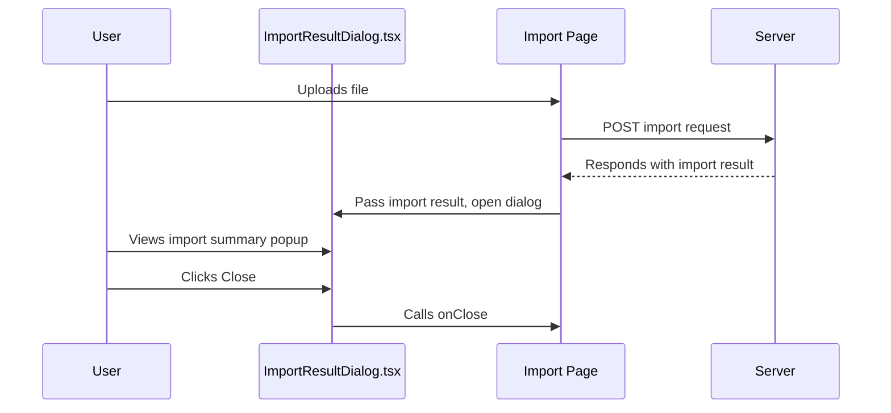

# Import Result Popup UI Component Plan

## Purpose
Create a **dedicated, reusable React component** to display a popup/modal summarizing the result of an import operation (e.g., attendance data import).

---

## Component Overview

### File
`iceplant_portal/frontend/src/components/ImportResultDialog.tsx`

### Props
- `open: boolean` — controls dialog visibility
- `onClose: () => void` — callback to close dialog
- `importResult: { success: boolean; records_imported: number; error_message?: string | null }` — import response info

### Features
- Material-UI `<Dialog>` component
- Displays:
  - Success or failure message
  - Number of records imported
  - Error message if any
- Close button to dismiss popup
- Styled consistently with existing modals

---

## UI Structure

- **Dialog**
  - **DialogTitle**
    - "Import Result"
  - **DialogContent**
    - If success:
      - "Successfully imported X records."
    - If failure:
      - "Import failed."
      - Show error message
  - **DialogActions**
    - "Close" button

---

## User Flow



---

## Usage Example

```jsx
<ImportResultDialog
  open={isResultDialogOpen}
  onClose={handleCloseResultDialog}
  importResult={importResult}
/>
```

---

## Benefits
- Clean separation of concerns
- Reusable for other imports
- Consistent user feedback
- Easy to maintain and extend

---

## Next Step
Implement this component and integrate it into the import workflow.