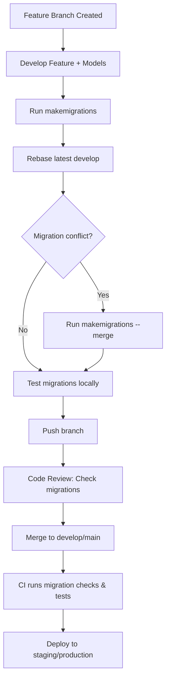

# Migration Protocol for IcePlant Backend

---

## 1. Overview
This protocol defines best practices and workflows for managing Django schema and data migrations in the IcePlant backend. It aims to reduce migration conflicts, ensure safe deployments, and maintain database integrity.

---

## 2. Migration Workflow

### Branching Strategy
- Developers work on **feature branches**.
- Before merging to `develop` or `main`:
  - **Rebase or merge latest `develop`** into your branch.
  - **Run `makemigrations`** again to detect conflicts early.
  - **Resolve conflicts locally** using Django's merge feature or manual edits.
  - **Test migrations** on a local database clone.

### Creating Migrations
- **One migration per feature**: Avoid multiple small migrations.
- **Avoid unnecessary migrations**: Run `makemigrations --check` before committing.
- **Use descriptive migration names** if customizing.
- **For complex changes:**
  - Use `RenameField` and `RenameModel` to preserve data.
  - Separate destructive changes (drops, deletes) into their own migration after deployment.
  - For data migrations, use `RunPython` with reversible functions.

### Handling Merge Conflicts
- When conflicts occur:
  - Run:
    ```
    python manage.py makemigrations --merge
    ```
  - Review the generated merge migration carefully.
  - If needed, manually edit migration dependencies and operations.
  - Test the merged migrations on a fresh database clone.

### Testing Migrations
- Apply migrations on:
  - A **fresh database** to ensure initial setup works.
  - An **existing database** to verify upgrade paths.
- Use:
  ```
  python manage.py migrate --plan
  ```
  to preview migration steps.

---

## 3. Best Practices

- **Reversible Data Migrations:** Always provide a `reverse_code` in `RunPython`.
- **Avoid Long-Running Data Migrations:** Run them separately or during maintenance windows.
- **Separate Schema and Data Migrations:** When possible, to reduce risk.
- **Avoid Destructive Changes in Large Migrations:** Drop fields/models in a separate migration after confirming no dependencies.
- **Review Migration Dependencies:** Ensure correct order and avoid circular dependencies.

---

## 4. Code Review Checklist for Migrations

- Are migration dependencies correct?
- Are data migrations reversible?
- Are destructive changes isolated?
- Has the migration been tested on fresh and existing databases?
- Are migration names descriptive and meaningful?

---

## 5. CI/CD Integration

- **Pre-merge pipeline should:**
  - Run `makemigrations --check` to detect missing migrations.
  - Run `migrate --plan` to preview changes.
  - Run tests after applying migrations on a fresh database.
- **Optional:** Add pre-commit hooks to warn if migrations are outdated or untested.

---

## 6. Troubleshooting Common Issues

| Issue | Solution |
|--------|----------|
| Merge conflicts in migration files | Use `makemigrations --merge` and review carefully |
| Migration fails on staging/prod | Check dependencies, database state, and apply missing migrations |
| Data loss after migration | Avoid destructive changes in initial migrations; separate deletions |
| Irreversible data migrations | Always provide `reverse_code` in `RunPython` |

---

## 7. Visual Workflow



---

## 8. Summary

- Rebase before merging to avoid conflicts.
- Use Django's merge migrations when conflicts arise.
- Test migrations thoroughly.
- Follow best practices for safe schema and data changes.
- Automate migration checks in CI/CD.
- Document and review all migration changes carefully.

---

## 9. Additional Recommendations

- **Backup before production migrations:** Always take a database backup before applying migrations on staging or production.
- **Leverage database transactions:** Django runs migrations in transactions by default; avoid raw SQL outside migrations that bypass this safety.
- **Version control fixtures:** If using fixtures for initial data, version them alongside migrations to ensure consistency.
- **Maintain consistent environments:** Use `requirements.txt` or `pip freeze` to keep dependencies aligned across dev, staging, and production.
- **Document manual SQL changes:** If raw SQL is necessary, document it clearly and avoid unless absolutely required.
- **Regularly audit migration status:** Use `showmigrations` and `migrate --plan` to verify applied migrations and detect issues early.

---