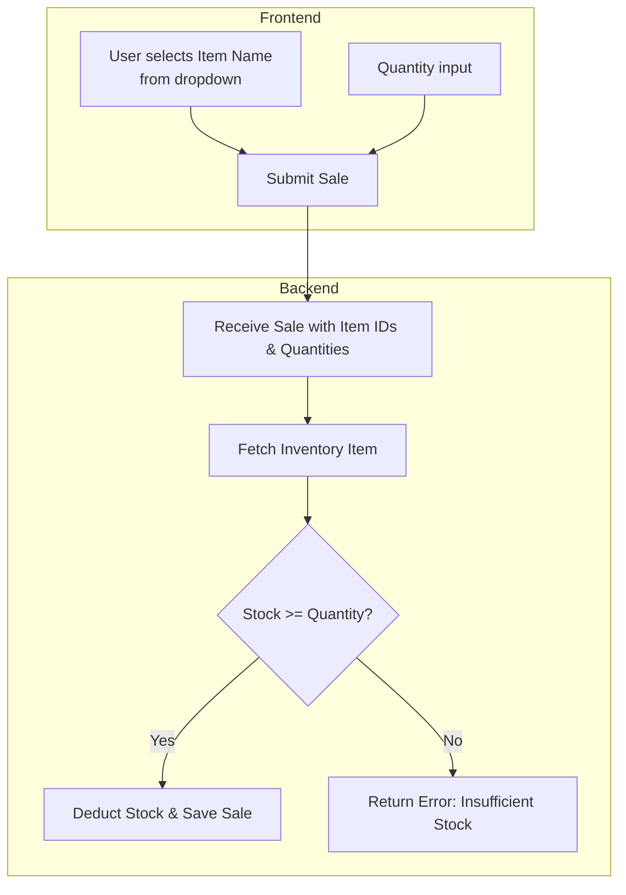

# Sales Page Enhancement Plan: Dynamic Item Names & Stock Validation

---

## Objective

Replace manual Item ID entry with dynamic Item Name selection, enforce stock validation, and update the Sales Page for better usability and data integrity.

---

## 1. Current State Summary

- **Dual Mode Sales Page** supports Iceplant and Inventory sales.
- **Inventory sales** currently require manual entry of Item IDs.
- **Backend** links sale items to inventory via FK but exposes only IDs.
- **No stock validation** during sale creation.
- **Project plan** calls for dynamic item selection and respecting stock counts.

---

## 2. Planned Enhancements

### Backend

- **Expose Item Names:**
  - Extend `SaleItemSerializer` to include a read-only `inventory_item_name` sourced from `self.inventory_item.item_name`.
  
- **Stock Validation:**
  - In `SaleSerializer.create()` and `update()`:
    - For each sale item:
      - Fetch the `Inventory` object.
      - Check if `inventory.quantity >= requested quantity`.
      - If not, raise a validation error.
      - If yes, deduct the quantity and save the inventory record.
      
- **Inventory API:**
  - Ensure endpoint `/api/inventory/items/` returns:
    - `id`
    - `item_name`
    - `quantity`
    - Only items marked `"For Sale"`.

---

### Frontend

- **Replace Manual ID Input:**
  - In `SalesForm.tsx`, replace "Inventory Item ID" text field with an **Autocomplete** or **Dropdown**.
  - Populate options dynamically from inventory API.
  - Show `item_name` and optionally stock count.
  - Store selected item's `id` in form data.
  
- **Display Item Names:**
  - In sales tables, display `item.inventory_item_name` instead of ID.
  
- **Stock Awareness:**
  - Optionally, show current stock next to each item in dropdown.
  - Disable or warn if requested quantity exceeds available stock (client-side check).

---

### Documentation

- Update this plan and `SALES_PAGE_REDESIGN_PLAN.md` to reflect:
  - Dynamic item selector.
  - Backend stock validation.
  - API response examples.

---

## 3. Data Flow Diagram

---

## 4. Implementation Steps

1. **Backend**
   - Extend serializers.
   - Add stock validation logic.
   - Adjust API responses.
   
2. **Frontend**
   - Replace ID input with dynamic selector.
   - Display item names.
   - Add client-side stock checks.
   
3. **Testing**
   - Attempt sales with sufficient and insufficient stock.
   - Verify UI updates.
   - Confirm API responses.

---

## 5. Expected Outcome

- **User-friendly** item selection.
- **Accurate** stock management.
- **Reduced errors** from manual ID entry.
- **Future-proof** design aligned with multi-category sales.

---