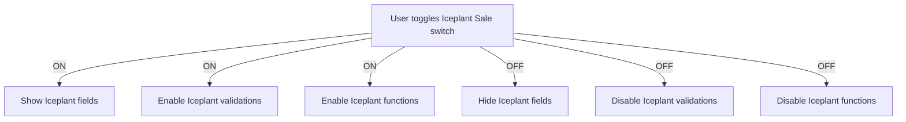

# Separation of Iceplant Sale and Regular Inventory Sale

## Objective
Create a clear separation between Iceplant sales and regular inventory sales in the UI, validation, and backend logic.

---

## Key Principles

- **When Iceplant Sale is OFF (regular sale):**
  - Hide Iceplant-specific fields.
  - Disable Iceplant-specific functions and validations.
  - Prevent backend from requiring Iceplant-specific data.
  - UI should not allow or require any Iceplant-related input.

- **When Iceplant Sale is ON (Iceplant sale):**
  - Show Iceplant-specific fields.
  - Enforce Iceplant-specific validations.
  - Enable Iceplant-specific functions.

---

## Implementation Plan

### 1. Identify Iceplant-specific fields and functions

- Fields:
  - `pickup_quantity`
  - `delivery_quantity`
  - `price_per_block`
  - Brine identifiers
  - Any other Iceplant-specific data
- Functions:
  - Total cost calculation
  - Overpayment validation
  - Iceplant-specific API logic

---

### 2. Conditional UI rendering

- Wrap Iceplant-specific fields in:
  ```tsx
  {formData.is_iceplant && (
    // Iceplant fields here
  )}
  ```
- This hides them when `is_iceplant` is false.

---

### 3. Conditional validation

- Enforce Iceplant-specific validations **only if** `formData.is_iceplant` is true.
- Skip these validations for regular sales.

---

### 4. Conditional API payload

- Always send zero or omit Iceplant fields when `is_iceplant` is false.
- Backend should accept zero/default values for these fields in regular sales.

---

### 5. Disable Iceplant-specific functions

- Wrap calculations and logic in:
  ```tsx
  if (formData.is_iceplant) {
    // Iceplant-specific logic
  }
  ```
- Skip these when `is_iceplant` is false.

---

### 6. UI toggle

- The "Iceplant Sale" toggle acts as a **mode switch**.
- When toggled ON, enable all Iceplant features.
- When toggled OFF, hide/disable all Iceplant features.

---

## Mermaid Diagram



---

## Summary

- The toggle **fully controls** the UI, validation, and logic.
- When OFF, the app behaves as a **regular inventory sale**.
- When ON, the app behaves as an **Iceplant sale** with all related features.

---

## Next Steps

- Implement this separation in the UI components.
- Adjust validation logic accordingly.
- Update API payload shaping.
- Test both modes thoroughly.