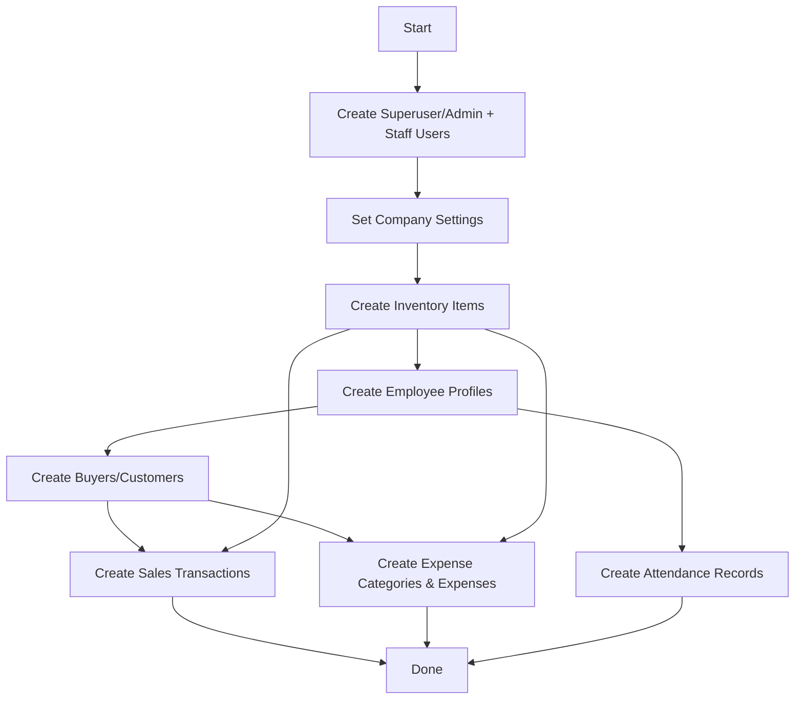

# Unified Test Data Protocol for IcePlant Backend

---

## 1. Overview

This protocol defines comprehensive best practices, guidelines, and implementation steps for creating, managing, and maintaining **realistic, interconnected, production-like test data** in the IcePlant backend. It complements the migration protocol to ensure safe, consistent, and effective test environments.

---

## 2. Principles

- **Realism:** Reflect actual business scenarios for ice plants, fabrication, hardware, and company operations.
- **Coverage:** Include buyers, inventory, sales, maintenance, expenses, employees, attendance, and company settings.
- **Compliance:** Populate all required fields to avoid integrity errors.
- **Isolation:** Avoid sensitive or production data in test environments.
- **Repeatability:** Scripts should be idempotent or resettable.
- **Documentation:** Clearly document assumptions and data generation logic.

---

## 3. Data Domains & Guidelines

| Domain                   | Details to Generate                                                                                     | Notes                                               |
|--------------------------|--------------------------------------------------------------------------------------------------------|-----------------------------------------------------|
| **Users**                | Superuser, admin, staff accounts with passwords                                                        | Exclude tokens, generate via createsuperuser API    |
| **Company**              | Name, address, contact info, logo, invoice footer                                                      | Use real or placeholder info                        |
| **Inventory**            | Ice blocks, salt, ammonia, packaging, steel, hardware, consumables                                    | Realistic quantities, units, min levels             |
| **Employees**            | Employee IDs, names, departments, join dates, active status                                            | Diverse profiles                                    |
| **Attendance**           | Check-in/out timestamps, departments, import dates                                                     | Multiple days, shifts, null check-outs              |
| **Buyers**               | Names, contacts, company info, business types                                                          | Link to sales                                       |
| **Sales**                | SI numbers, sale dates/times, buyers, quantities, prices, payment details                              | Link to buyers and inventory                        |
| **Expenses & Categories**| Categories (taxes, utilities, payroll), expenses with payees, amounts, dates, payment methods          | Some linked to inventory                            |
| **Maintenance**          | Assets, maintenance records with descriptions and statuses                                             | Cover typical equipment                             |

---

## 4. Data Generation Order



---

## 5. Implementation Outline

- Use Django ORM to create objects.
- Use fixtures or factory methods for complex data.
- Add randomization or preset samples for variety.
- Link related data (e.g., sales to buyers, attendance to employees).
- Exclude sensitive data like tokens and sessions.
- Add CLI flags:
  - `--reset` to clear existing data
  - `--volume` to control data size
- **Management Command:** `generate_sample_data`
- **Location:** `iceplant_portal/companyconfig/management/commands/generate_sample_data.py`
- **Features:**
  - Idempotent (`get_or_create`) or resettable (`--reset`)
  - Options:
    - `--reset`: Clears existing data
    - `--volume=N`: Controls data size
  - Logging progress and summary

---

## 6. Usage Instructions

```bash
python manage.py generate_sample_data --reset --volume=100
```

- `--reset`: Clears existing data before generation.
- `--volume`: Number of records per domain (default e.g., 50).

---

## 7. When to Run Test Data Generation

- **After applying all schema migrations.**
- Before testing or staging deployments.
- When refreshing test data.
- After destructive changes or resets.

---

## 8. Best Practices

- Use management commands or fixtures for data loading.
- Avoid hardcoding IDs; use lookups or create related objects dynamically.
- Reset test data regularly to avoid stale or inconsistent states.
- Version control test data scripts and fixtures.
- Document assumptions or special cases.
- Update test data scripts whenever models change.
- Review and test data loading after migrations.

---

## 9. Compliance Checklist

- [ ] All required fields populated
- [ ] Realistic values used
- [ ] Covers all business domains
- [ ] No sensitive/production data
- [ ] Scripts/fixtures tested and versioned
- [ ] Documentation updated

---

## 10. Summary

This unified protocol ensures:

- Realistic, interconnected, production-like test data
- Respect for data dependencies and integrity
- Easy, repeatable generation with a single command
- Clear, maintainable workflows aligned with migrations
- Improved development, testing, and deployment quality

---

## 11. Detailed Test Data Generation & Database-Specific Notes

### Data Generation Order (Respect Dependencies)

1. **Users** (superuser, staff)
2. **Employee Profiles**
3. **Inventory Items**
4. **Buyers**
5. **Expense Categories & Expenses**
6. **Sales** (linked to buyers, with SaleItems linked to inventory)
7. **Inventory Adjustments**
8. **Maintenance Items & Records**

*Company settings and attendance data are **excluded** from automated generation.*

---

### Key Model Dependencies

- **SaleItem** references **Inventory** with `on_delete=PROTECT`. Delete SaleItems before Inventory.
- **Sale** references **Buyer** and contains SaleItems.
- **Expense** references **ExpenseCategory** and **User** (created_by, approved_by).
- **MaintenanceRecord** references **MaintenanceItem**.

---

### Resetting Data

- **Order matters!** When clearing data, delete in this order:
  1. SaleItems
  2. Sales
  3. Inventory
  4. Buyers
  5. Expenses
  6. ExpenseCategories
  7. Employees
  8. Users (except superuser)
- This avoids `ProtectedError` due to foreign key constraints.

---

### Timezone Handling

- **Always use timezone-aware datetimes** (`django.utils.timezone.now()` or `timezone.datetime(...)`) for all `DateTimeField`s.
- Avoid naive `datetime.now()` to prevent warnings and ensure correct timezone behavior.

---

### Special Notes

- **Company Settings**: Set manually, not via script.
- **Attendance**: Existing test data preserved, not overwritten.
- **SaleItems**: Must be created after Sales and Inventory.
- **Inventory Adjustments**: Created after Inventory.
- **Maintenance**: Equipment and records generated last.

---

### Recommendations for Future Test Data Scripts

- Respect the above order and dependencies.
- Use `update_or_create()` for idempotency.
- Add CLI flags for:
  - `--reset` (clear data safely)
  - `--volume` (control data size)
- Document any new model dependencies or constraints.
- Update this section with new findings or changes.

---

### Test Data Generation Flowchart (Detailed)

```mermaid
flowchart TD
    A[Start] --> U[Create Users]
    U --> E[Create Employee Profiles]
    U --> I[Create Inventory Items]
    I --> IA[Generate Inventory Adjustments]
    E --> B[Create Buyers]
    B --> X[Create Expenses & Categories]
    I --> S[Create Sales]
    B --> S
    S --> SI[Create Sale Items]
    I --> SI
    I --> M[Create Maintenance Items]
    M --> MR[Create Maintenance Records]
    X --> Done[Done]
    SI --> Done
    IA --> Done
    MR --> Done
    E --> Done
    %% Skipped parts
    subgraph Skipped
        CS[Company Settings (manual)]
        AT[Attendance (existing)]
    end
    A --> CS
    A --> AT
```

This flowchart illustrates the recommended order and dependencies for generating test data, with company settings and attendance explicitly skipped.

---

## 12. Page-Specific Test Data Fields Checklist

| **Page / Model** | **Fields to Populate** | **Notes** |
|------------------|------------------------|-----------|
| **Sales** | si_number, sale_date, sale_time, status, buyer, buyer_name, buyer_contact, po_number, is_iceplant, pickup_quantity, delivery_quantity, brine1_identifier, brine2_identifier, price_per_block, **Sale Items:** inventory_item, quantity, unit_price | Link to buyers and inventory |
| **Buyers** | name, contact_person, phone, email, company_name, business_type, address |  |
| **Inventory** | item_name, category, quantity, unit, min_level, adjustments |  |
| **Expenses** | category, payee, amount, date, payment_method, approved_by, created_by |  |
| **Maintenance** | item_name, description, status, maintenance_date, cost |  |
| **Employees** | employee_id, name, department, join_date, status |  |
| **Users** | username, email, role, is_staff, is_superuser, password |  |

This checklist ensures **all fields visible or editable on each page** are covered by test data generation, improving UI testing coverage and data realism.

---

## 13. Automated Modular Test Data Generation (2025 Update)

To generate a large, realistic, interconnected dataset covering approximately **4 months** of business activity, use the following modular management commands:

```bash
python manage.py generate_users --reset
python manage.py generate_employees --reset --volume=50
python manage.py generate_buyers --reset --volume=50
python manage.py generate_inventory --reset --volume=20
python manage.py generate_sales --reset --volume=200
python manage.py generate_expenses --reset --volume=200
python manage.py generate_maintenance --reset --volume=100
```

### Automated Script

Alternatively, run **all commands sequentially** using the provided shell script:

```bash
bash generate_all_test_data.sh
```

This script resets and generates fresh, detailed Filipino-context test data for all domains, with increased volume settings suitable for multi-month testing.

### Notes

- The modular approach allows generating or resetting data **per page/domain** independently.
- The increased volumes simulate **hundreds of sales and expenses**, dozens of employees and buyers, and extensive maintenance records.
- Dates are randomized between **January 1, 2025 and today** for realism.
- This supplements the previous unified protocol, providing a scalable, maintainable, and production-like test dataset.

---
---