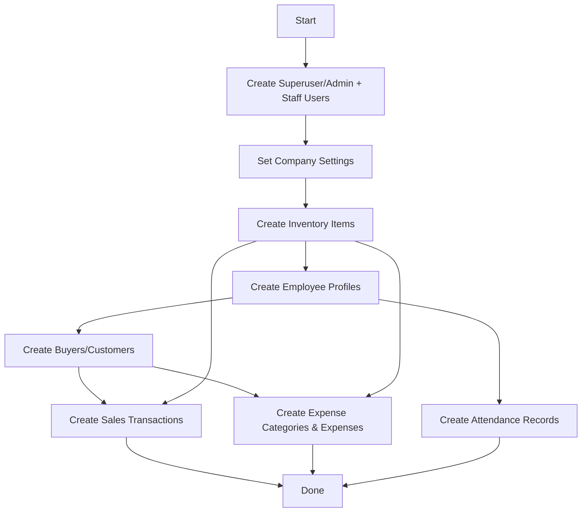

# Unified Test Data Protocol for IcePlant Backend

---

## 1. Overview

This protocol defines comprehensive best practices, guidelines, and implementation steps for creating, managing, and maintaining **realistic, interconnected, production-like test data** in the IcePlant backend. It complements the migration protocol to ensure safe, consistent, and effective test environments.

---

## 2. Principles

- **Realism:** Reflect actual business scenarios for ice plants, fabrication, hardware, and company operations.
- **Coverage:** Include buyers, inventory, sales, maintenance, expenses, employees, attendance, and company settings.
- **Compliance:** Populate all required fields to avoid integrity errors.
- **Isolation:** Avoid sensitive or production data in test environments.
- **Repeatability:** Scripts should be idempotent or resettable.
- **Documentation:** Clearly document assumptions and data generation logic.

---

## 3. Data Domains & Guidelines

| Domain                   | Details to Generate                                                                                     | Notes                                               |
|--------------------------|--------------------------------------------------------------------------------------------------------|-----------------------------------------------------|
| **Users**                | Superuser, admin, staff accounts with passwords                                                        | Exclude tokens, generate via createsuperuser API    |
| **Company**              | Name, address, contact info, logo, invoice footer                                                      | Use real or placeholder info                        |
| **Inventory**            | Ice blocks, salt, ammonia, packaging, steel, hardware, consumables                                    | Realistic quantities, units, min levels             |
| **Employees**            | Employee IDs, names, departments, join dates, active status                                            | Diverse profiles                                    |
| **Attendance**           | Check-in/out timestamps, departments, import dates                                                     | Multiple days, shifts, null check-outs              |
| **Buyers**               | Names, contacts, company info, business types                                                          | Link to sales                                       |
| **Sales**                | SI numbers, sale dates/times, buyers, quantities, prices, payment details                              | Link to buyers and inventory                        |
| **Expenses & Categories**| Categories (taxes, utilities, payroll), expenses with payees, amounts, dates, payment methods          | Some linked to inventory                            |
| **Maintenance**          | Assets, maintenance records with descriptions and statuses                                             | Cover typical equipment                             |

---

## 4. Data Generation Order



---

## 5. Implementation Outline

- Use Django ORM to create objects.
- Use fixtures or factory methods for complex data.
- Add randomization or preset samples for variety.
- Link related data (e.g., sales to buyers, attendance to employees).
- Exclude sensitive data like tokens and sessions.
- Add CLI flags:
  - `--reset` to clear existing data
  - `--volume` to control data size
- **Management Command:** `generate_sample_data`
- **Location:** `iceplant_portal/companyconfig/management/commands/generate_sample_data.py`
- **Features:**
  - Idempotent (`get_or_create`) or resettable (`--reset`)
  - Options:
    - `--reset`: Clears existing data
    - `--volume=N`: Controls data size
  - Logging progress and summary

---

## 6. Usage Instructions

```bash
python manage.py generate_sample_data --reset --volume=100
```

- `--reset`: Clears existing data before generation.
- `--volume`: Number of records per domain (default e.g., 50).

---

## 7. When to Run Test Data Generation

- **After applying all schema migrations.**
- Before testing or staging deployments.
- When refreshing test data.
- After destructive changes or resets.

---

## 8. Best Practices

- Use management commands or fixtures for data loading.
- Avoid hardcoding IDs; use lookups or create related objects dynamically.
- Reset test data regularly to avoid stale or inconsistent states.
- Version control test data scripts and fixtures.
- Document assumptions or special cases.
- Update test data scripts whenever models change.
- Review and test data loading after migrations.

---

## 9. Compliance Checklist

- [ ] All required fields populated
- [ ] Realistic values used
- [ ] Covers all business domains
- [ ] No sensitive/production data
- [ ] Scripts/fixtures tested and versioned
- [ ] Documentation updated

---

## 10. Summary

This unified protocol ensures:

- Realistic, interconnected, production-like test data
- Respect for data dependencies and integrity
- Easy, repeatable generation with a single command
- Clear, maintainable workflows aligned with migrations
- Improved development, testing, and deployment quality