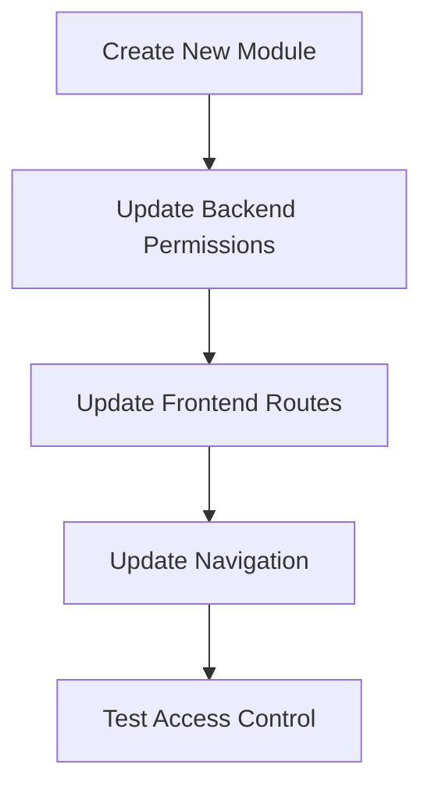

# Extending the Permission System

This guide provides technical instructions for developers who need to extend the group-based access control system with new modules or custom permission rules.

## Adding a New Module

When adding a new functional module to the application, you'll need to update both the backend and frontend components of the permission system.



### 1. Update Backend Module Mapping

Open `iceplant_core/group_permissions.py` and add your new module to the `MODULE_GROUP_MAPPING`:

```python
# Define which groups can access which modules
MODULE_GROUP_MAPPING = {
    'attendance': ['HR', 'Managers', 'Admins'],
    'sales': ['Sales', 'Accounting', 'Managers', 'Admins'],
    # Add your new module here
    'your_new_module': ['GroupA', 'GroupB', 'Managers', 'Admins'],
}
```

### 2. Apply Permissions to Views

In your new module's views.py file, import the permission classes and apply them:

```python
from iceplant_core.group_permissions import IsInGroups, HasModulePermission, ReadOnly
from rest_framework.permissions import IsAuthenticated

class YourNewModelViewSet(viewsets.ModelViewSet):
    queryset = YourNewModel.objects.all()
    serializer_class = YourNewModelSerializer
    permission_classes = [IsAuthenticated, HasModulePermission('your_new_module')]
    
    # Optional: Different permissions for different actions
    def get_permissions(self):
        if self.action in ['list', 'retrieve']:
            # Read permissions
            return [IsAuthenticated(), HasModulePermission('your_new_module')]
        else:
            # Write permissions
            return [IsAuthenticated(), IsInGroups(['GroupA', 'Managers', 'Admins'])]
```

### 3. Update Frontend AuthContext

Open `frontend/src/contexts/AuthContext.tsx` and update the `hasAccess` method to include your new module:

```jsx
const hasAccess = (module: string): boolean => {
  if (!user) return false;
  if (user.isSuperuser) return true;
  
  const moduleAccessMapping: Record<string, string[]> = {
    'attendance': ['HR', 'Managers', 'Admins'],
    'sales': ['Sales', 'Accounting', 'Managers', 'Admins'],
    // Add your new module here
    'your_new_module': ['GroupA', 'GroupB', 'Managers', 'Admins'],
  };
  
  const allowedGroups = moduleAccessMapping[module] || [];
  return isInGroup(allowedGroups);
};
```

### 4. Add Protected Route

Open `frontend/src/App.tsx` and add a protected route for your new module:

```jsx
<Route path="/your-new-module" element={
  <GroupRoute allowedGroups={['GroupA', 'GroupB', 'Managers', 'Admins']}>
    <YourNewModulePage />
  </GroupRoute>
} />
```

### 5. Update Navigation Menu

Open `frontend/src/layouts/DashboardLayout.tsx` and add your new module to the navigation items:

```jsx
const navigationItems = [
  // Existing items...
  { 
    text: 'Your New Module', 
    icon: <YourIcon />, 
    path: '/your-new-module',
    requiredModules: ['your_new_module'],
    requiredGroups: ['GroupA', 'GroupB', 'Managers', 'Admins'] 
  },
];
```

## Creating Custom Permission Classes

Sometimes you need more complex permission logic than the standard group-based permissions. Here's how to create a custom permission class:

### 1. Create a New Permission Class

Add a new class to `iceplant_core/group_permissions.py`:

```python
class YourCustomPermission(permissions.BasePermission):
    """
    Custom permission class with specific logic.
    """
    
    def has_permission(self, request, view):
        # Check for general permission to access the view
        # Return True if permitted, False otherwise
        
        # Example: only allow access during business hours
        current_hour = timezone.now().hour
        if not (9 <= current_hour < 17):
            return False
            
        # Fall back to group-based permission
        return IsInGroups(['GroupA', 'GroupB']).has_permission(request, view)
    
    def has_object_permission(self, request, view, obj):
        # Check for permission to access a specific object
        # Return True if permitted, False otherwise
        
        # Example: only allow access to objects created by the user
        return obj.created_by == request.user
```

### 2. Apply the Custom Permission Class

Apply your custom permission class to views:

```python
class YourModelViewSet(viewsets.ModelViewSet):
    queryset = YourModel.objects.all()
    serializer_class = YourModelSerializer
    permission_classes = [IsAuthenticated, YourCustomPermission]
```

## Adding Object-Level Permissions

Object-level permissions restrict access to specific instances of a model based on user attributes.

### 1. Implement has_object_permission

Extend an existing permission class or create a new one with object-level checks:

```python
class OwnerOnlyPermission(permissions.BasePermission):
    """
    Permission that allows only the owner to access an object.
    """
    
    def has_object_permission(self, request, view, obj):
        # Check if the user is the owner of the object
        return hasattr(obj, 'owner') and obj.owner == request.user
```

### 2. Apply to a ViewSet

```python
class YourModelViewSet(viewsets.ModelViewSet):
    queryset = YourModel.objects.all()
    serializer_class = YourModelSerializer
    permission_classes = [IsAuthenticated, HasModulePermission('your_module'), OwnerOnlyPermission]
```

## Testing Permission Changes

After making changes to the permission system, it's essential to test them thoroughly:

### Backend Testing

1. Create a test file for your permissions: `tests/test_permissions.py`
2. Test each permission class with different user types:

```python
from django.test import TestCase
from django.contrib.auth.models import User, Group
from rest_framework.test import APIRequestFactory, force_authenticate
from iceplant_core.group_permissions import IsInGroups, HasModulePermission

class PermissionTests(TestCase):
    def setUp(self):
        # Create test users and groups
        self.user = User.objects.create_user(username='testuser', password='testpass')
        self.manager_group = Group.objects.create(name='Managers')
        self.sales_group = Group.objects.create(name='Sales')
        
    def test_is_in_groups_permission(self):
        # Test with user not in group
        request = APIRequestFactory().get('/')
        force_authenticate(request, user=self.user)
        permission = IsInGroups(['Managers'])
        self.assertFalse(permission.has_permission(request, None))
        
        # Test with user in group
        self.user.groups.add(self.manager_group)
        self.assertTrue(permission.has_permission(request, None))
```

### Frontend Testing

1. Create a test file for your frontend permission components
2. Test with different user group scenarios:

```jsx
import { render, screen } from '@testing-library/react';
import { AuthProvider } from '../contexts/AuthContext';
import GroupRoute from '../components/GroupRoute';

describe('GroupRoute', () => {
  it('renders children when user has permission', () => {
    // Mock user with appropriate group
    const user = { group: 'Managers', isSuperuser: false };
    
    render(
      <AuthProvider initialUser={user}>
        <GroupRoute allowedGroups={['Managers', 'Admins']}>
          <div data-testid="protected-content">Protected Content</div>
        </GroupRoute>
      </AuthProvider>
    );
    
    expect(screen.getByTestId('protected-content')).toBeInTheDocument();
  });
  
  it('does not render children when user lacks permission', () => {
    // Mock user with inappropriate group
    const user = { group: 'Sales', isSuperuser: false };
    
    render(
      <AuthProvider initialUser={user}>
        <GroupRoute allowedGroups={['HR', 'Admins']}>
          <div data-testid="protected-content">Protected Content</div>
        </GroupRoute>
      </AuthProvider>
    );
    
    expect(screen.queryByTestId('protected-content')).not.toBeInTheDocument();
  });
});
```

## Advanced Permission Techniques

### Combining Permission Classes

You can combine permission classes using logical operators:

```python
from rest_framework.permissions import IsAuthenticatedOrReadOnly

# User must be authenticated AND either be in the right group OR it's a read-only request
permission_classes = [
    IsAuthenticated & (IsInGroups(['Managers']) | ReadOnly)
]
```

### Dynamic Permission Assignment

You can dynamically adjust permissions based on request parameters or other factors:

```python
def get_permissions(self):
    if self.request.query_params.get('public', 'false') == 'true':
        return [AllowAny()]
    elif self.action in ['list', 'retrieve']:
        return [IsAuthenticated(), ReadOnly()]
    else:
        return [IsAuthenticated(), IsInGroups(['Managers', 'Admins'])]
```

## Performance Considerations

When implementing complex permission systems, keep performance in mind:

1. **Cache Group Memberships**: Consider caching user group memberships to reduce database queries
2. **Minimize Permission Checks**: Avoid redundant permission checks in loops or nested views
3. **Use select_related/prefetch_related**: When checking object-level permissions, optimize database queries

## Best Practices for Permission System Development

1. **Consistent Naming**: Use consistent naming conventions for groups and permissions
2. **Document Changes**: Always update documentation when modifying the permission system
3. **Test Coverage**: Maintain comprehensive test coverage for permission classes
4. **Keep Frontend/Backend in Sync**: Ensure changes to backend permissions are reflected in frontend protection
5. **Audit Trail**: Consider logging permission checks and access denials for security auditing
