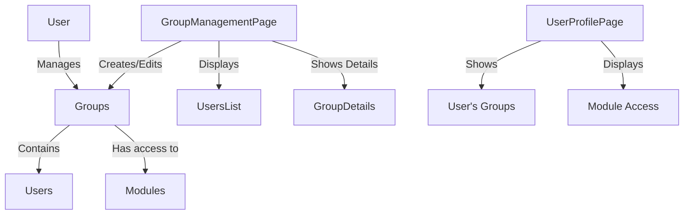

# Group-Based Access Control UI Implementation

## Overview

This document provides an overview of the user interface implementation for the group-based access control system in the Iceplant Management Portal. The implementation aligns with the requirements outlined in the `UI_SOLUTION_ACCESS_CONTROL.md` document.

## Components Implemented

### Backend Components

1. **Group API Endpoints**
   - `/api/users/groups/` - CRUD operations for groups
   - `/api/users/groups/<id>/add_users/` - Add users to a group
   - `/api/users/groups/<id>/remove_users/` - Remove users from a group
   - `/api/users/user-management/assign_groups/` - Assign groups to users

2. **User Management API**
   - `/api/users/user-management/` - List of users with their group assignments

3. **Permissions API**
   - `/api/users/me/permissions/` - Get current user's permissions and module access

### Frontend Components

1. **Group Management Page**
   - Located at `/group-management`
   - Accessible only to superusers
   - Provides interfaces for:
     - Creating, editing, and deleting groups
     - Managing group members
     - Viewing module permissions for groups

2. **User Management Interface**
   - User list with group assignments
   - Interface for assigning users to groups

3. **User Profile Page**
   - Located at `/profile`
   - Shows user's personal information
   - Displays groups the user belongs to
   - Lists module access and permissions

4. **Navigation Updates**
   - Added "Group Management" to superuser menu items
   - Added "My Profile" button to the header

## Usage

### Managing Groups

1. **Accessing Group Management**
   - Login as a superuser
   - Navigate to "Group Management" in the side navigation
   
2. **Creating a New Group**
   - Click "New Group" button
   - Enter group name
   - Click "Create"

3. **Managing Group Members**
   - Select a group from the list
   - To add members:
     - Click "Add Members"
     - Select users from the list
     - Click "Add Selected"
   - To remove members:
     - Click the delete icon next to a user in the group details

4. **Editing Group Name**
   - Select a group
   - Click "Edit Name"
   - Enter new name
   - Click "Save"

### Managing User Group Assignments

1. **Assigning Groups to Users**
   - Go to the "Users" tab in Group Management
   - Find the user you want to edit
   - Click the edit icon
   - Select/deselect groups
   - Click "Save Changes"

### Viewing Your Profile

1. **Accessing Your Profile**
   - Click on your username in the header
   - Or click the "My Profile" button
   - View your personal information, groups, and permissions

## Architecture

## Permissions

The UI respects the existing permission system:

- **Superusers** can access all functionality
- **Regular users** can only view their own profile

## Technical Details

- The implementation uses Material-UI components for consistent styling
- Group management is protected by the `<SuperAdminRoute>` component
- User profile is available to all authenticated users
- API endpoints are protected with Django permission classes to ensure security

## Future Enhancements

1. **Role-based Permission Editor**
   - Add an interface for modifying the module-group mapping
   
2. **Permission Audit Log**
   - Track changes to group memberships and permissions
   
3. **Batch Operations**
   - Add support for bulk user-group assignments

4. **Permission Request Workflow**
   - Allow users to request additional permissions
   - Implement approval workflows for permission requests
