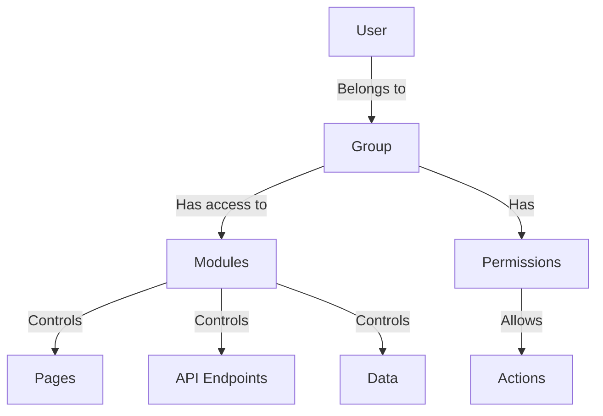
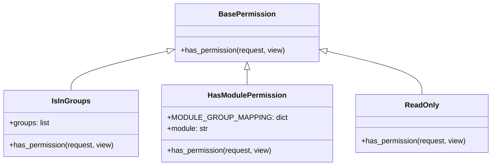
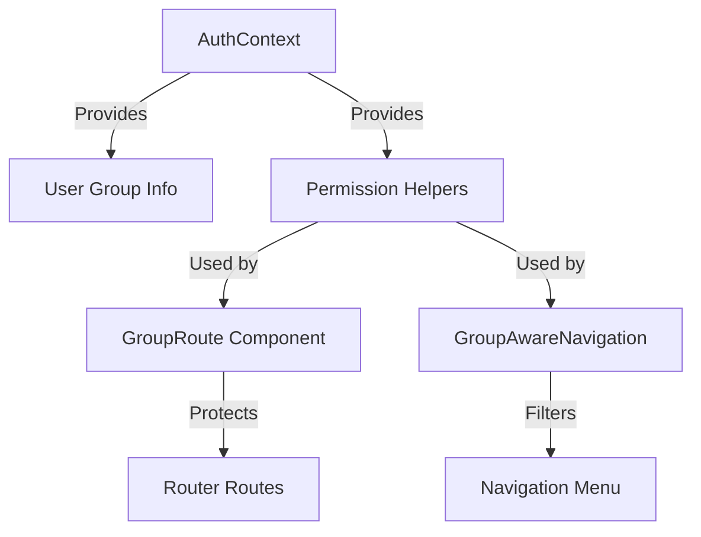
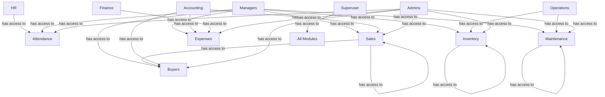
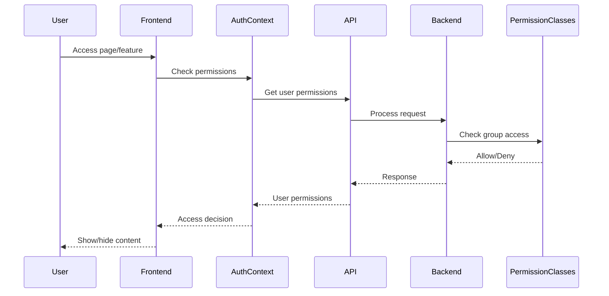

# Group-Based Access Control System

## Overview

The Group-Based Access Control (GBAC) system in our application provides a comprehensive way to control user access to various parts of the application based on their group membership. This document explains how the system works and how to configure it for different access requirements.



## System Components

### 1. Backend Permission Classes

The core of our GBAC system is implemented in `iceplant_core/group_permissions.py`, which provides three key permission classes:



#### `IsInGroups`

This permission class checks if a user belongs to at least one of the specified groups.

```python
# Usage example
permission_classes = [IsInGroups(['Managers', 'Accounting'])]
```

#### `HasModulePermission`

This permission class controls access to specific modules based on a predefined mapping of modules to allowed groups.

```python
# Usage example
permission_classes = [HasModulePermission('attendance')]
```

#### `ReadOnly`

This permission class only allows read-only methods (GET, HEAD, OPTIONS).

```python
# Usage example
permission_classes = [HasModulePermission('attendance') | ReadOnly()]
```

### 2. Frontend Components

The frontend implements group-based access control through these components:



#### `AuthContext` Extensions

The `AuthContext` provides helper methods for checking permissions:

- `hasAccess(module)`: Checks if the user has access to a specific module
- `isInGroup(groupName)`: Checks if the user belongs to specific groups

#### `GroupRoute` Component

This component restricts access to routes based on user groups:

```jsx
<GroupRoute allowedGroups={['HR', 'Managers']} redirectPath="/access-denied">
  <AttendancePage />
</GroupRoute>
```

#### `GroupAwareNavigation` Component

This component only displays navigation items that the user has permission to access.

## Module Group Mappings

The following table shows which groups have access to different modules:

| Module | Allowed Groups |
|--------|----------------|
| attendance | HR, Managers, Admins |
| sales | Sales, Accounting, Managers, Admins |
| inventory | Inventory, Operations, Managers, Admins |
| expenses | Accounting, Finance, Managers, Admins |
| maintenance | Maintenance, Operations, Managers, Admins |
| buyers | Sales, Accounting, Managers, Admins |



## Implementation Guide

### How to Apply Group-Based Access to a Django View

1. Import the permission classes:

```python
from iceplant_core.group_permissions import IsInGroups, HasModulePermission, ReadOnly
```

2. Apply the permissions to your view:

```python
class YourViewSet(viewsets.ModelViewSet):
    # ...
    permission_classes = [IsAuthenticated, HasModulePermission('module_name')]
    
    def get_permissions(self):
        if self.action in ['list', 'retrieve']:
            # Read operations
            return [IsAuthenticated(), HasModulePermission('module_name')]
        else:
            # Write operations
            return [IsAuthenticated(), IsInGroups(['GroupName1', 'GroupName2'])]
```

### How to Add Group-Based Protection to a React Route

1. Import the `GroupRoute` component:

```jsx
import GroupRoute from '../components/GroupRoute';
```

2. Wrap your route with the `GroupRoute` component:

```jsx
<Route path="/your-path" element={
  <GroupRoute allowedGroups={['GroupName1', 'GroupName2']}>
    <YourComponent />
  </GroupRoute>
} />
```

### How to Update the Navigation Menu for Group-Based Access

1. Add a new menu item to the `navigationItems` array in `DashboardLayout.tsx`:

```jsx
{
  text: 'Your Module',
  icon: <YourIcon />,
  path: '/your-path',
  requiredGroups: ['GroupName1', 'GroupName2'],
  requiredModules: ['your_module']
}
```

## User Permissions API

The system includes an API endpoint to check user permissions:

- **Endpoint**: `/api/users/me/permissions/`
- **Returns**: Information about the user's groups, module access, and specific permissions

## Best Practices

1. **Consistent Permission Checking**: Use the same group names throughout the application.

2. **Module-Based Access**: Organize permissions around functional modules rather than individual views or components.

3. **Superuser Override**: Always include an override for superusers in permission checks.

4. **Frontend and Backend Consistency**: Keep the frontend and backend permission logic in sync.

## Access Control Flow



## Administration

### Managing User Groups

1. Access the Django Admin interface at `/admin/auth/group/`
2. Create groups with appropriate names (e.g., "HR", "Managers", "Sales")
3. Add users to these groups via the user management interface

### Adding New Module Permissions

1. Update `MODULE_GROUP_MAPPING` in `group_permissions.py`
2. Update the frontend `AuthContext.hasAccess` method
3. Add appropriate router protection in `App.tsx`
4. Update the navigation items in `DashboardLayout.tsx`

## Troubleshooting

### User Cannot Access a Page They Should Have Access To

1. Check if the user is assigned to the correct group in Django Admin
2. Verify that the group is listed in `MODULE_GROUP_MAPPING` for the relevant module
3. Check if the `GroupRoute` component is configured correctly
4. Inspect the browser console for any permission-related errors

### Unexpected Access to Restricted Pages

1. Verify that all routes are properly protected with `GroupRoute`
2. Check if the permission classes are correctly applied to all API endpoints
3. Confirm that the navigation items have the correct `requiredGroups` settings

## Conclusion

The Group-Based Access Control system provides a flexible and robust way to manage user permissions throughout the application. By organizing permissions around functional modules and user groups, we can easily configure who has access to what without modifying code.
