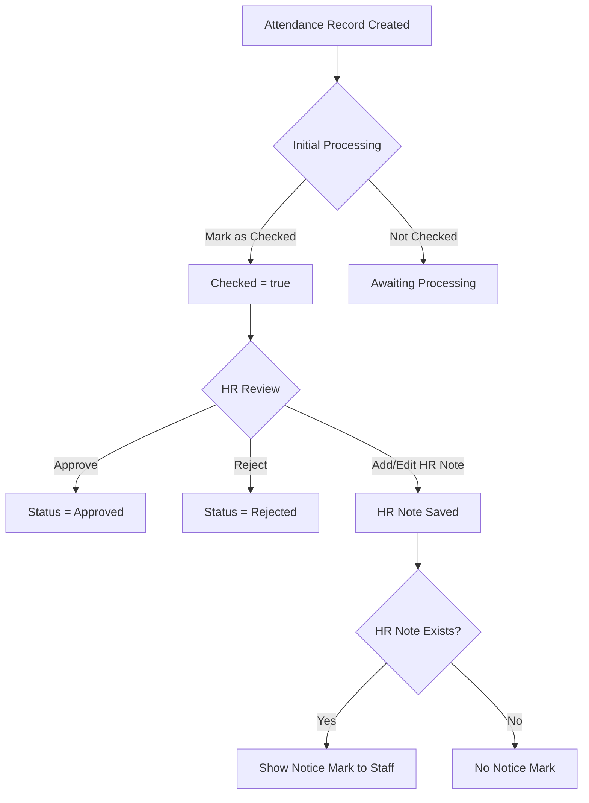

# HR Attendance Approval & Notice Mark Plan

---

## Overview

This document defines the unified approach for **HR attendance approval workflows** and the **HR Notice Mark** feature, which alerts Staff users when internal HR notes exist for an employee's attendance record.

---

## Data Model

| Field               | Type       | Visibility                     | Description                                               |
|---------------------|------------|--------------------------------|-----------------------------------------------------------|
| `checked`           | boolean    | HR, Staff                      | Initial processing done                                   |
| `approval_status`   | enum       | HR, Staff                      | `pending`, `approved`, `rejected`                         |
| `hr_note`           | string     | **HR only**                    | Internal HR comments                                      |
| `hr_note_exists`    | boolean    | HR, Staff                      | True if `hr_note` is non-empty                            |

---

## Approval & Notice Workflow

- **Initial Processing:** Admin/Payroll marks record as **Checked**.
- **HR Review:**
  - HR sets **approval status**: Pending, Approved, Rejected.
  - HR adds **internal note** (`hr_note`), visible only to HR.
- **Notice Mark:**
  - If an HR note exists, a **Notice Mark icon** (e.g., ⚠️) is shown to **Staff** users.
  - Staff **cannot view** the note content, only the presence of a note.

---

## Backend Logic

- When HR adds or updates a note:
  - Set `hr_note_exists = true` if note is non-empty.
  - Set `hr_note_exists = false` if note is empty or deleted.
- API responses:
  - **HR users:** receive full `hr_note` content and `hr_note_exists`.
  - **Staff users:** receive only `hr_note_exists` (boolean), **not** the note content.
- Approval status is visible to both groups.

---

## Frontend/UI Behavior

### HR Users

- Can **view and edit** HR notes.
- Can **approve or reject** attendance records.
- See **approval status** and **checked** status.
- Do **not** see the Notice Mark (since they see the note itself).

### Staff Users

- Can **view approval status** and **checked** status.
- **Cannot view** HR notes.
- See a **Notice Mark icon** (e.g., ⚠️) if `hr_note_exists` is true.
- Tooltip on icon: **"HR note present"**.

---

## Combined Workflow Diagram

---

## API Considerations

- **GET /attendance/**
  - Returns:
    - `checked`
    - `approval_status`
    - `hr_note_exists`
    - `hr_note` (only if user is HR)
- **PATCH /attendance/{id}/**
  - HR can update:
    - `approval_status`
    - `hr_note`
    - `checked`
- **Role-based filtering** to hide `hr_note` from Staff.

---

## Security & Permissions

- **HR Group:**
  - Full access to approval status, HR notes, and editing.
- **Staff Group:**
  - View approval status and checked.
  - See Notice Mark if HR note exists.
  - Cannot view or edit HR notes.

---

## Future Enhancements

- Audit logs for approval and note changes.
- Bulk approval and note management.
- Notification system for new HR notes.
- Configurable icons or alerts for Notice Mark.
- Export options including HR notes (HR only).

---

## Last Updated

April 10, 2025