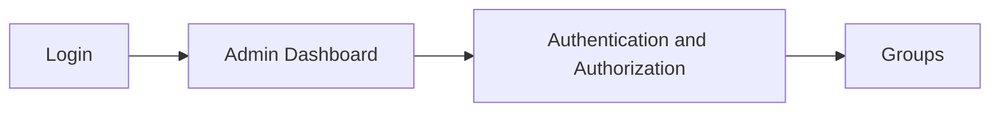
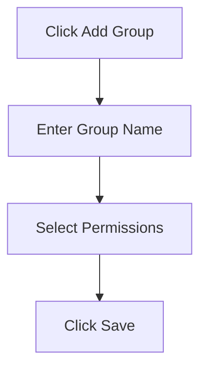
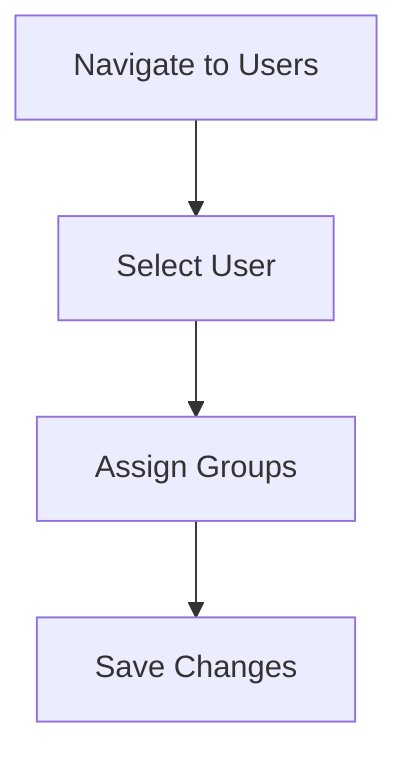

# Managing User Groups and Permissions

This guide provides step-by-step instructions for setting up and managing user groups and permissions in the Django admin interface.

## Creating and Managing Groups

### Accessing the Admin Interface

1. Log in to the Django admin interface at `/admin/` with a superuser account
2. Navigate to **Authentication and Authorization** > **Groups**

### Creating a New Group

1. Click the **Add Group +** button in the top right corner
2. Enter a name for the group (e.g., "HR", "Sales", "Managers")
3. Select permissions from the available permissions list
4. Click **Save** to create the group

### Standard Groups in Our System

| Group Name | Description | Key Permissions |
|------------|-------------|----------------|
| HR | Human Resources staff | Manage attendance, view employee profiles |
| Managers | Department managers | Manage their department's data, approve records |
| Sales | Sales department staff | Manage sales data, view buyer information |
| Accounting | Accounting department | Manage expenses, view sales records |
| Inventory | Inventory managers | Manage inventory items and stock |
| Operations | Operations staff | Manage equipment and maintenance |
| Finance | Finance department | Manage budgets and expenses |
| Maintenance | Maintenance staff | Manage equipment maintenance |
| Admins | Administrative staff | Advanced administrative functions |

## Assigning Users to Groups

### Method 1: Through the User Admin Interface

1. Navigate to **Authentication and Authorization** > **Users**
2. Click on a user to edit their profile
3. In the **Groups** field, select the appropriate groups
4. Click **Save** to apply the changes

### Method 2: Bulk Assignment through Group Interface

1. Navigate to **Authentication and Authorization** > **Groups**
2. Click on the group you want to modify
3. In the **Users** section, select users to add to the group
4. Click **Save** to apply the changes

## Creating Custom Permissions

While our application primarily uses group-based permissions, you can also create custom permissions for more granular control:

1. Navigate to **Authentication and Authorization** > **Permissions**
2. Click **Add Permission +**
3. Select the content type (model) the permission applies to
4. Enter a codename and name for the permission
5. Click **Save** to create the permission

## Setting Up Common Access Scenarios

### Scenario 1: Department Manager

For a department manager, you typically want to provide access to their department's data plus some cross-departmental viewing capabilities:

1. Create a user for the manager
2. Add them to both the "Managers" group and their department-specific group (e.g., "Sales" for a Sales Manager)
3. This will give them management permissions plus department-specific access

### Scenario 2: Standard Department Staff

For standard staff members who should only access their department's data:

1. Create a user for the staff member
2. Add them only to their department-specific group (e.g., "HR" for an HR staff member)

### Scenario 3: Administrative Staff

For administrative staff who need broad access but aren't superusers:

1. Create a user for the admin staff member
2. Add them to the "Admins" group
3. Add them to any specific department groups if needed

## Verifying User Permissions

After setting up groups and assigning users, it's important to verify that the permissions are working correctly:

1. Log in as the user whose permissions you want to verify
2. Navigate to the user permissions check page: `/api/users/me/permissions/`
3. Review the returned JSON data to confirm the user has the expected groups and module access
4. Test accessing different parts of the application to ensure the permissions are applied correctly

## Best Practices

1. **Use Descriptive Group Names**: Choose group names that clearly indicate the role or department

2. **Minimize Superuser Accounts**: Limit the number of superuser accounts, using group-based permissions instead

3. **Regular Audits**: Periodically review user group assignments to ensure they're up to date

4. **Documentation**: Maintain documentation of which groups have access to which modules 

5. **Test After Changes**: Always test permission changes with affected user accounts

## Troubleshooting Common Issues

### User Can't Access Expected Features

1. Check that the user is assigned to the correct group(s)
2. Verify that the group is included in the module mapping for that feature
3. Check if any custom permissions are required and assigned

### User Has Unexpected Access

1. Review all groups the user belongs to (they might be in multiple groups)
2. Check the permission mappings in `group_permissions.py`
3. Verify the configuration in frontend route protection

### Changes to Permissions Not Taking Effect

1. Ensure the user has logged out and back in after permission changes
2. Clear browser cache and cookies
3. Check if the permission changes were saved correctly in the admin interface

## Additional Resources

For more information on Django's authentication system:
- [Django Official Documentation: Authentication](https://docs.djangoproject.com/en/stable/topics/auth/)
- [Django Official Documentation: Permissions](https://docs.djangoproject.com/en/stable/topics/auth/default/#permissions-and-authorization)
