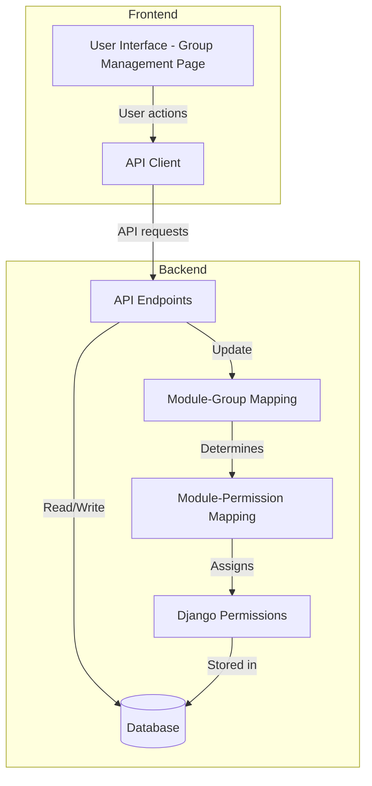
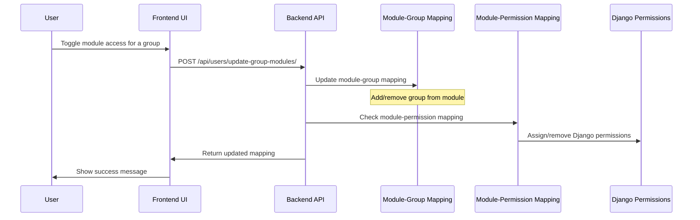
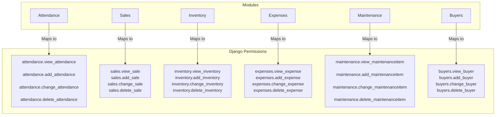
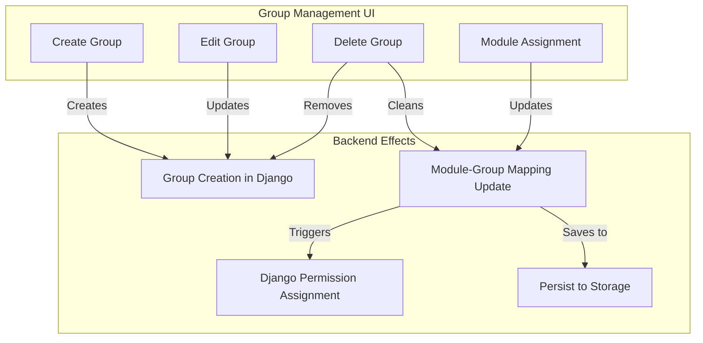
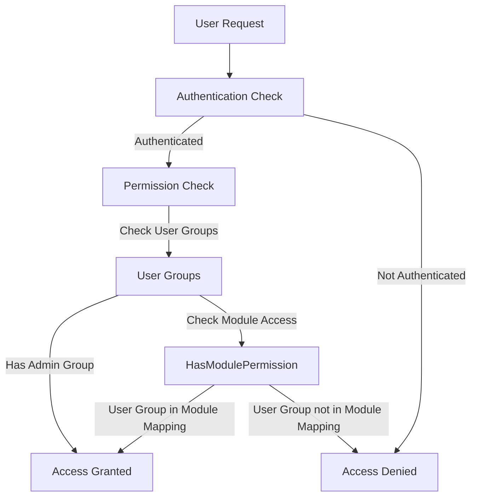
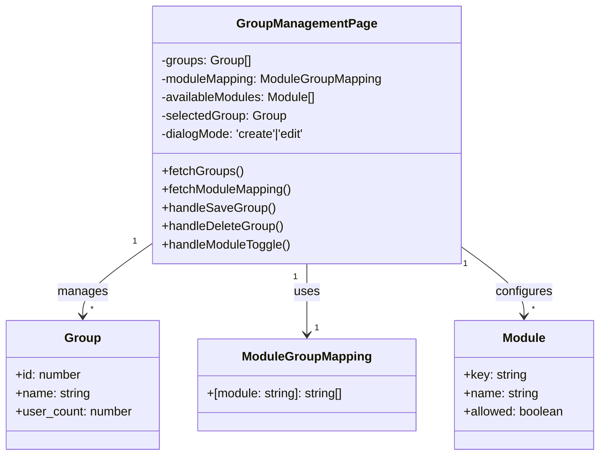
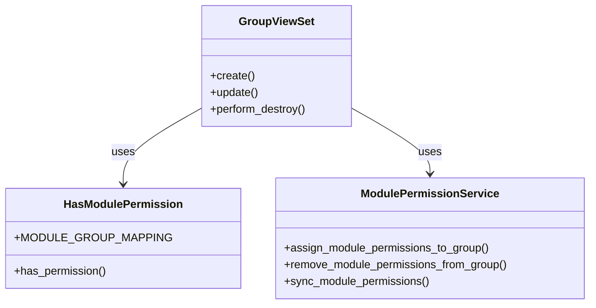

# Module Permission System Documentation

## Overview

The Module Permission System in the IcePlant Management Portal provides a structured approach to manage access control across different functional modules of the application. It connects high-level module concepts with specific Django permissions, ensuring that users with access to a module have all the necessary permissions to perform actions within that module.

## How Module Permissions Work

The system uses a two-tier approach:

1. **Module-Group Mapping**: Defines which user groups have access to which modules
2. **Module-Permission Mapping**: Maps each module to specific Django permissions

When a group is assigned to a module, it automatically receives all the Django permissions necessary to work with that module's functionality.

## System Architecture



## Data Flow



## Module-Group Mapping

The module-group mapping defines which groups have access to which modules. It's stored in `HasModulePermission.MODULE_GROUP_MAPPING` and persisted to a JSON file:

```json
{
  "attendance": ["HR", "Managers", "Admins"],
  "sales": ["Sales", "Accounting", "Managers", "Admins"],
  "inventory": ["Inventory", "Operations", "Managers", "Admins"],
  "expenses": ["Accounting", "Finance", "Managers", "Admins"],
  "maintenance": ["Maintenance", "Operations", "Managers", "Admins"],
  "buyers": ["Sales", "Accounting", "Managers", "Admins"]
}
```

## Module-Permission Mapping

Each module is mapped to specific Django permissions in `MODULE_PERMISSION_MAPPING`:



## Group Management and Module Assignment

When managing groups and their module access through the Group Management page:



## User Access Control Flow



## Implementation Details

### Frontend Implementation

The Group Management page allows administrators to:
1. Create new groups
2. Edit existing groups
3. Delete groups
4. Assign modules to groups



### Backend Implementation

The backend handles:
1. Storing and retrieving group information
2. Managing the module-group mapping
3. Assigning and revoking Django permissions based on module access



## Module Access Logic

Modules represent logical groupings of functionality in the IcePlant Management Portal. Each module:

1. **Maps to a specific department or cross-department function**
   - Attendance → HR Department
   - Sales → Sales Department
   - Inventory → Operations/Warehouse Department
   - Expenses → Finance/Accounting Department
   - Maintenance → Operations/Maintenance Department
   - Buyers → Sales/Customer Relations Department

2. **Contains a set of related functionalities**
   - Each module includes capabilities to view, create, edit, and delete relevant records
   - Some modules have additional specialized permissions (e.g., approving attendance records)

3. **Has well-defined permission boundaries**
   - Permissions don't overlap between modules
   - Access to one module doesn't grant access to another module
   - Cross-cutting concerns are managed by assigning multiple modules to a group

## Best Practices for Module Assignment

When assigning modules to groups, consider the following:

1. **Use the Principle of Least Privilege**
   - Only assign modules that are necessary for the group's function
   - Regularly review and audit module assignments

2. **Consider Departmental Structure**
   - Align module assignments with your organizational structure
   - Use group names that reflect departments or job functions

3. **Use Role-Based Assignment**
   - Create groups based on roles, not individuals
   - Assign users to groups, not directly to modules

4. **Document Module-Permission Relationships**
   - Maintain documentation of which permissions are included in each module
   - When adding new functionalities, update the module-permission mapping

## Troubleshooting Common Issues

### Issue: User can see a module but can't perform actions

**Potential causes:**
- Django permissions aren't correctly assigned to the group
- Permissions for new functionalities were added but the module-permission mapping wasn't updated

**Solution:**
- Run `sync_module_permissions()` to synchronize module permissions with Django permissions
- Update MODULE_PERMISSION_MAPPING if new permissions are needed

### Issue: Changes to module assignments don't persist after server restart

**Potential causes:**
- Module permissions aren't being saved to disk
- Permissions file is corrupted or inaccessible

**Solution:**
- Verify that `save_module_permissions()` is being called after updates
- Check file permissions and structure of the JSON file

### Issue: Wrong permissions assigned to a module

**Potential causes:**
- Error in the MODULE_PERMISSION_MAPPING definition
- Database migrations created new permissions that aren't included in the mapping

**Solution:**
- Update MODULE_PERMISSION_MAPPING with the correct permissions
- Run the sync function to apply the updated mapping

## Conclusion

The Module Permission System provides a flexible and maintainable way to manage access control in the IcePlant Management Portal. By connecting high-level modules to specific Django permissions, it simplifies group management while ensuring precise access control.
