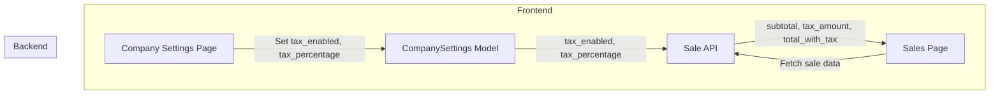

# TAX Implementation Plan for IcePlant Management Portal

---

## Objective
Integrate TAX handling into the backend and sales logic, complementing the existing frontend UI in Company Settings and Sales pages.

---

## Current State
- **Frontend:** CompanySettingsPage already has TAX input fields.
- **Backend:** `CompanySettings` model does **not** store TAX info yet.
- **Sales:** TAX is **not** applied or displayed in sale calculations or serializers.

---

## Implementation Steps

### 1. Extend Backend Models
- **CompanySettings model**
  - Add fields:
    - `tax_percentage` (DecimalField, e.g., 12.00)
    - `tax_enabled` (BooleanField, default False)
- **Migration:** Create and apply migration for these fields.

---

### 2. Update Backend Serializers
- **CompanySettingsSerializer**
  - Include `tax_percentage` and `tax_enabled` in fields.
- **SaleSerializer**
  - Add computed fields:
    - `subtotal` (sum of item costs)
    - `tax_amount` (if enabled, subtotal * tax_percentage / 100)
    - `total_with_tax` (subtotal + tax_amount)

---

### 3. Update Backend Views
- **CompanySettingsViewSet**
  - Ensure tax fields are saved and retrieved.
- **SaleViewSet**
  - When creating/updating sales, calculate and return tax-inclusive totals.

---

### 4. Update Frontend Sales Page
- Fetch company tax settings.
- Display subtotal, tax amount, and total with tax in sale summaries and print views.
- Respect `tax_enabled` toggle.

---

### 5. Testing
- **Backend:**
  - Test API responses include correct tax calculations.
  - Test toggling tax enabled/disabled.
- **Frontend:**
  - Verify UI updates with tax info.
  - Check sale creation and display with tax applied.

---

## Data Flow Diagram

---

## Summary
- Add tax fields to backend models.
- Calculate tax in sales API.
- Display tax info in frontend.
- Test end-to-end.

---

*Prepared on 2025-04-08*