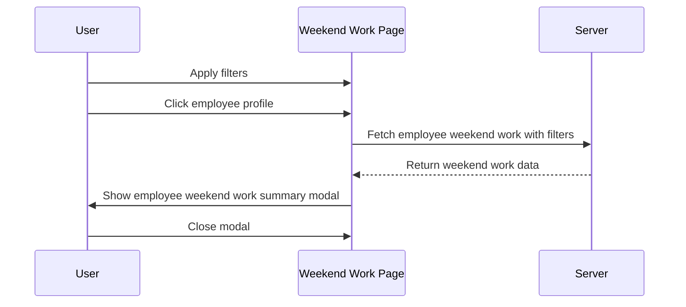

# Weekend Work Employee Summary Feature Plan

## Objective
Enhance the Weekend Work page to display a detailed summary of an employee's weekend work when their profile is clicked, respecting the active filters.

---

## User Flow

1. User applies filters (date range, department, etc.) on Weekend Work page.
2. User clicks on an employee profile.
3. A modal/dialog opens showing:
   - A summary of that employee's weekend work **matching the active filters**.
   - Data displayed as rows, one per day.
4. User can close the modal to return to the main view.

---

## UI Components

- **Employee Profile Clickable Element**
  - Add an `onClick` handler to employee rows/cards.
- **Employee Weekend Work Summary Modal**
  - Title: Employee name + "Weekend Work Summary"
  - Table/List with columns:
    - Date
    - Weekend work status (Yes/No)
    - Hours worked
    - Notes/comments
  - Close button

---

## Data Handling

- **Filters**
  - Use the current filters (date range, department, etc.) when fetching data.
- **API**
  - Backend endpoint to fetch weekend work data for a specific employee with filters.
  - Example: `/api/weekend-work/employee/{employee_id}/?start_date=...&end_date=...&department=...`
- **Frontend**
  - On employee click, send request with filters.
  - Populate modal with response data.

---

## Accessibility

- Trap focus inside modal when open.
- Return focus to employee list when modal closes.
- Use semantic HTML and ARIA roles.

---

## Mermaid Diagram

---

## Benefits

- Quick access to detailed employee weekend work info.
- Context-aware (respects filters).
- Improves usability and data transparency.

---

## Next Steps

- Design API endpoint if not existing.
- Implement modal component.
- Integrate click handler and data fetching.
- Test with various filters and employees.
