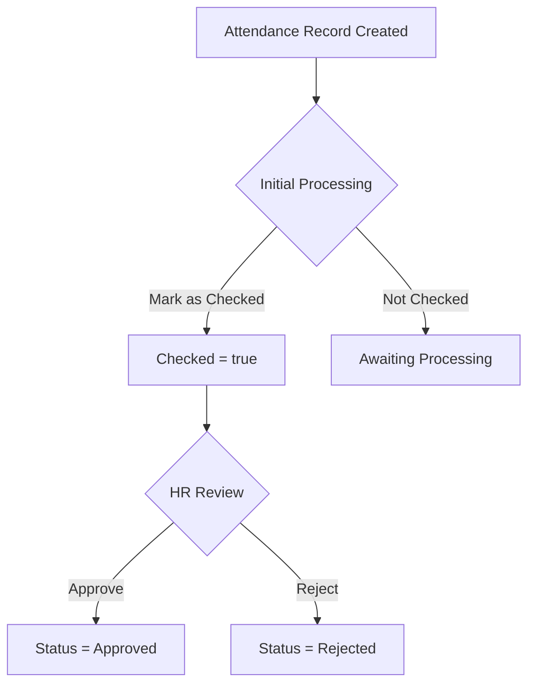
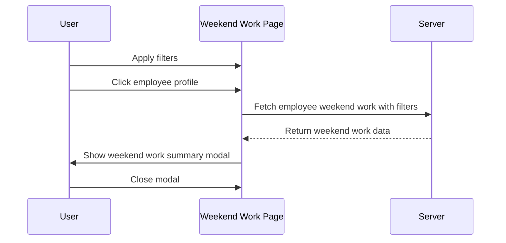
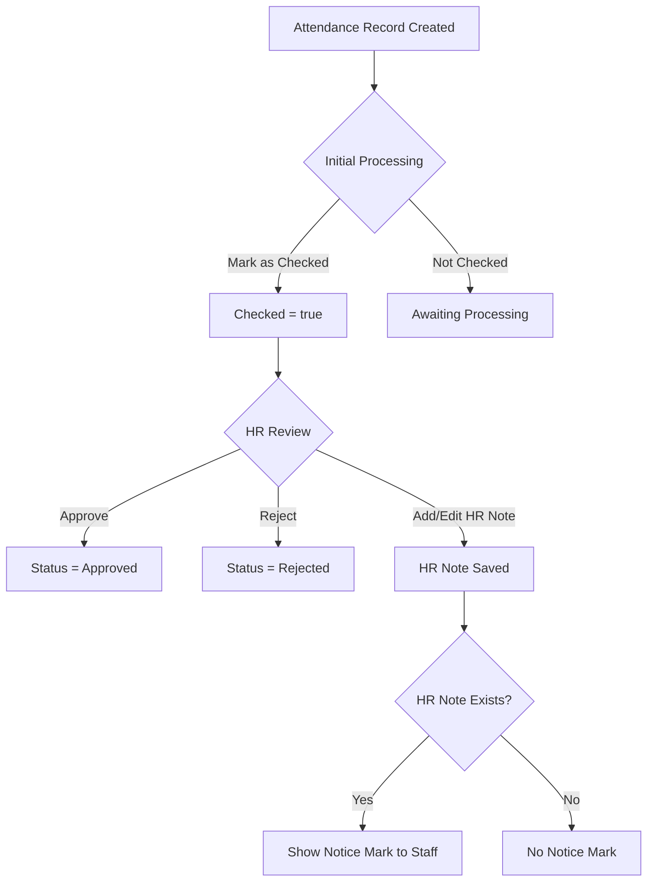

# Attendance System Mermaid Diagrams

---

## Processing & Approval Workflow

---

## Weekend Work Employee Summary Sequence

---

## HR Notice Mark & Approval Combined Workflow

---

## Last Updated

April 10, 2025