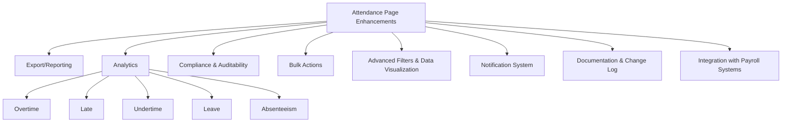

# Attendance Page Enhancement Context

_Last updated: April 11, 2025_

---

## 1. Current Attendance Page Features & Limitations

### Features
- View, filter, and search attendance records by date, department, and employee.
- Track total hours worked, clock-in/out times.
- "Checked" flag for initial processing; HR approval workflow (Pending, Approved, Rejected).
- Weekend work summary with approval workflow and export (planned).
- Inline HR notes, approval actions, and checked toggles.
- Import attendance data.
- Pagination and search for large datasets.

### Limitations
- No advanced analytics (overtime, late, undertime, leave, absenteeism).
- Export/reporting is planned but not fully implemented.
- No audit logs or compliance tracking.
- No bulk actions (e.g., bulk check, bulk approve).
- Limited filters and no advanced data visualization.
- No notification system for status changes or approvals.
- Documentation and change log not integrated with the UI.

---

## 2. HR/Payroll Industry Standards for Attendance Analytics & Reporting

- **Analytics:** Overtime, lateness, undertime, leave balances, absenteeism, shift adherence.
- **Reporting:** Export to Excel/PDF, summary and detailed reports, audit trails.
- **Compliance:** Audit logs for all changes, approval workflows, data retention policies.
- **Bulk Actions:** Mass approval, corrections, or flagging.
- **Advanced Filters:** By date, department, shift, status, and custom fields.
- **Notifications:** Automated alerts for anomalies, approvals, or missing data.
- **Visualization:** Charts for trends (absenteeism, overtime, late arrivals).

---

## 3. Technical Constraints

- **Scope:** Enhancements must align with current UI/UX and backend architecture.
- **Documentation:** All changes must be documented per DEVELOPMENT_GUIDELINES.md.
- **Version Control:** Use Git; all changes require descriptive commit messages and must be tracked in a change log.

---

## 4. Task Decomposition & Acceptance Criteria

### Export/Reporting
- **Tasks:** Implement export to PDF/Excel for filtered attendance and weekend work.
- **Acceptance Criteria:** 
  - User can export current view.
  - Exported files match displayed data.
  - Export includes all applied filters.

### Analytics (Overtime, Late, Undertime, Leave, Absenteeism)
- **Tasks:** Add analytics widgets/tables; calculate and display metrics.
- **Acceptance Criteria:** 
  - Metrics are accurate.
  - Metrics update with filters.
  - Metrics match industry definitions.

### Compliance & Auditability
- **Tasks:** Implement audit logs for all approval and checked actions.
- **Acceptance Criteria:** 
  - All changes are logged with user, timestamp, and action.
  - Logs are exportable and filterable.

### Bulk Actions
- **Tasks:** Add bulk check/approve/reject for selected records.
- **Acceptance Criteria:** 
  - User can select multiple records and apply actions.
  - Backend and UI update accordingly.

### Advanced Filters & Data Visualization
- **Tasks:** Add filters (e.g., by status, shift, custom fields); implement charts for trends.
- **Acceptance Criteria:** 
  - Filters work in combination.
  - Charts update with filters and display key trends.

### Notification System
- **Tasks:** Notify users of approvals, rejections, or anomalies.
- **Acceptance Criteria:** 
  - Users receive timely, relevant notifications in-app and/or via email.

### Documentation & Change Log
- **Tasks:** Update documentation for all enhancements; maintain a change log.
- **Acceptance Criteria:** 
  - All features are documented.
  - Change log is up to date and accessible.

---

## 5. Integration with Payroll Systems

### Objectives
- Ensure seamless data flow between attendance and payroll modules/systems.
- Support export formats compatible with payroll software (e.g., CSV, Excel, API integration).
- Enable mapping of attendance codes (e.g., overtime, leave types) to payroll codes.
- Provide audit trails for all data transferred to payroll.

### Tasks
- Identify required data fields and formats for payroll integration.
- Implement export or API endpoints for payroll consumption.
- Document mapping between attendance and payroll codes.
- Ensure compliance with data privacy and security standards.

### Acceptance Criteria
- Payroll exports/APIs include all required fields and are compatible with payroll system(s).
- Mapping documentation is complete and up to date.
- All data transfers are logged for auditability.
- No data loss or corruption during transfer.

---

## 6. Enhancement Areas Diagram

---

## 7. Coordination & Tracking

- This file serves as the single source of context for all downstream implementation tasks.
- Each enhancement area should be tracked with its own issue/ticket, referencing the acceptance criteria above.
- Updates to this file should be made as enhancements are designed, implemented, and released.