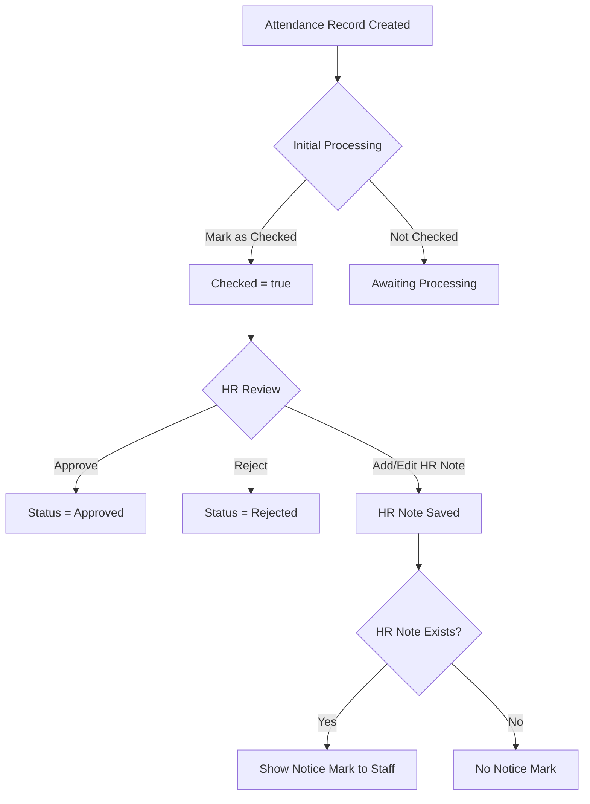

.3# HR Attendance Approval & Notice Plan

---

## Overview

This document defines the unified approach for **HR attendance approval workflows** and the **HR Notice Mark** feature, including UI behavior, backend logic, data model, and security considerations.

_Last updated: April 10, 2025_

---

## Objectives

- Streamline HR approval and rejection of attendance records.
- Provide clear UI feedback for approval status.
- Enable HR to add internal notes.
- Alert staff users when HR notes exist (without revealing content).
- Maintain auditability and security.

---

## Data Model

| Field               | Type       | Visibility                     | Description                                               |
|---------------------|------------|--------------------------------|-----------------------------------------------------------|
| `checked`           | boolean    | HR, Staff                      | Initial processing done                                   |
| `approval_status`   | enum       | HR, Staff                      | `pending`, `approved`, `rejected`                         |
| `hr_note`           | string     | **HR only**                    | Internal HR comments                                      |
| `hr_note_exists`    | boolean    | HR, Staff                      | True if `hr_note` is non-empty                            |

---

## Approval & Notice Workflow

- **Initial Processing:** Admin/Payroll marks record as **Checked**.
- **HR Review:**
  - HR sets **approval status**: Pending, Approved, Rejected.
  - HR adds **internal note** (`hr_note`), visible only to HR.
- **Notice Mark:**
  - If an HR note exists, a **Notice Mark icon** (e.g., ⚠️) is shown to **Staff** users.
  - Staff **cannot view** the note content, only the presence of a note.

---

## Frontend/UI Behavior

### HR Users

- Can **view and edit** HR notes.
- Can **approve or reject** attendance records.
- See **approval status** and **checked** status.
- Do **not** see the Notice Mark (since they see the note itself).

### Staff Users

- Can **view approval status** and **checked** status.
- **Cannot view** HR notes.
- See a **Notice Mark icon** (e.g., ⚠️) if `hr_note_exists` is true.
- Tooltip on icon: **"HR note present"**.

---

## Approval Button UI Logic

| Current Status   | Show Approve Button? | Show Reject Button? | Approve Button Style/Label          | Approve Button Action                                  |
|------------------|----------------------|---------------------|-------------------------------------|--------------------------------------------------------|
| **Pending**      | Yes                  | Yes                 | Green, label "Approve"              | Approves without reason prompt                         |
| **Rejected**     | Yes                  | Yes                 | Green, label "Approve"              | Approves without reason prompt                         |
| **Approved**     | Yes                  | **No**              | **Gray, label "Approved"**          | Prompts for reason, then changes to Rejected if reason |

- **Reject button hidden** when status is Approved.
- **Approve button turns into gray "Approved" label** but remains clickable.
- Clicking "Approved" prompts for a reason to **revoke approval**.
- No change for Pending or Rejected states.
- No change for non-HR users.

---

## UI Implementation Notes

- **Reject button** should be conditionally hidden when approved:

```tsx
{record.approval_status !== 'approved' && (
  <Button>Reject</Button>
)}
```

- **Approve button** styling and label:

```tsx
<Button
  variant="outlined"
  size="small"
  color={record.approval_status === 'approved' ? 'inherit' : 'success'}
  onClick={() => handleUpdateAttendanceApprovalStatus(record.id, 'approved', record.approval_status)}
  sx={{
    mr: 0.5,
    ...(record.approval_status === 'approved' && {
      color: 'gray',
      borderColor: 'gray',
      cursor: 'pointer',
    }),
  }}
>
  {record.approval_status === 'approved' ? 'Approved' : 'Approve'}
</Button>
```

---

## Combined Workflow Diagram



---

## API Considerations

- **GET /attendance/**
  - Returns:
    - `checked`
    - `approval_status`
    - `hr_note_exists`
    - `hr_note` (only if user is HR)
- **PATCH /attendance/{id}/**
  - HR can update:
    - `approval_status`
    - `hr_note`
    - `checked`
- **Role-based filtering** to hide `hr_note` from Staff.

---

## Security & Permissions

- **HR Group:**
  - Full access to approval status, HR notes, and editing.
- **Staff Group:**
  - View approval status and checked.
  - See Notice Mark if HR note exists.
  - Cannot view or edit HR notes.

---

## Future Enhancements

- Audit logs for approval and note changes.
- Bulk approval and note management.
- Notification system for new HR notes.
- Configurable icons or alerts for Notice Mark.
- Export options including HR notes (HR only).