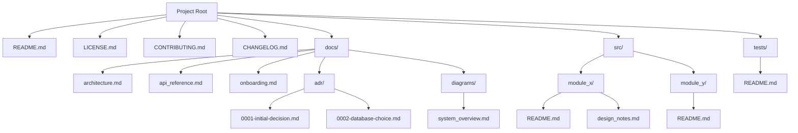

# Best Practices for Markdown Files in Software Projects

## 1. Writing High-Quality Markdown Files

- **Use clear, descriptive titles** with `#` headings.
- **Organize content hierarchically** with headings (`#`, `##`, `###`) for easy navigation.
- **Use bullet points or numbered lists** for clarity.
- **Include code snippets** with fenced code blocks (```) and specify language for syntax highlighting.
- **Add links** to related docs, issues, or external resources.
- **Embed images or diagrams** to illustrate concepts.
- **Use tables** for structured data.
- **Keep paragraphs concise** and focused.
- **Maintain consistent formatting** throughout the project.
- **Use horizontal rules (`---`)** to separate sections if needed.
- **Follow naming conventions:**
  - Use descriptive filenames (`API_GUIDE.md`, `DATABASE_PLAN.md`)
  - Prefer uppercase with underscores or hyphens for readability
  - Avoid spaces in filenames

---

## 2. Organizing Markdown Files in Your Project

### Root-Level Markdown Files
Store **project-wide** documentation at the root:

- `README.md` — Overview, setup, usage
- `CONTRIBUTING.md` — How to contribute
- `LICENSE.md` — Licensing info
- `CODE_OF_CONDUCT.md` — Community guidelines
- `CHANGELOG.md` — Release notes
- `SECURITY.md` — Security policies

### `/docs` Directory
For **extensive documentation**, create a dedicated folder:

```
/docs
  ├── architecture.md
  ├── api_reference.md
  ├── onboarding.md
  ├── design_decisions.md
  ├── tutorials/
  │     ├── setup_guide.md
  │     └── feature_walkthrough.md
  └── diagrams/
        └── system_overview.md
```

### Feature or Module-Specific Docs
Colocate Markdown files **inside feature folders** for context:

```
/src/module_x/
  ├── module_code.py
  ├── README.md          # Explains this module
  └── design_notes.md    # Design rationale
```

### Architecture Decision Records (ADRs)
Store ADRs in a dedicated folder:

```
/docs/adr/
  ├── 0001-initial-decision.md
  ├── 0002-database-choice.md
  └── 0003-auth-strategy.md
```

---

## 3. Proper Usage of Markdown Files

- **Project Overview:** `README.md` with description, setup, usage, contact info
- **Developer Onboarding:** Step-by-step guides, environment setup
- **Design & Architecture:** Diagrams (e.g., Mermaid), flowcharts, rationale
- **API Documentation:** Endpoints, request/response examples
- **Changelogs:** Track changes/releases
- **Meeting Notes & Protocols:** Decisions, action items
- **Linking:** Use relative links to connect docs
- **Embedding Diagrams:** Use Mermaid or images for clarity
- **Documentation Generation:** Use tools like MkDocs, Docusaurus, or static site generators to render Markdown nicely
- **Version Control:** Keep Markdown files under version control (Git) for history and collaboration

---

## 4. Suggested Folder Structure

```plaintext
/project-root
│
├── README.md
├── LICENSE.md
├── CONTRIBUTING.md
├── CHANGELOG.md
│
├── docs/
│   ├── architecture.md
│   ├── api_reference.md
│   ├── onboarding.md
│   ├── adr/
│   │    ├── 0001-initial-decision.md
│   │    └── 0002-database-choice.md
│   └── diagrams/
│        └── system_overview.md
│
├── src/
│   ├── module_x/
│   │    ├── code.py
│   │    ├── README.md
│   │    └── design_notes.md
│   └── module_y/
│        ├── code.py
│        └── README.md
│
└── tests/
    └── README.md
```

---

## 5. Mermaid Diagram: Markdown Organization



---

## Summary

- Use Markdown for **clear, well-structured documentation**
- Store **project-wide docs at root**
- Use `/docs` for **detailed or extensive documentation**
- Colocate **module-specific docs** with code
- Use **consistent naming conventions**
- Leverage **links and diagrams** for clarity
- Keep Markdown files **version-controlled**