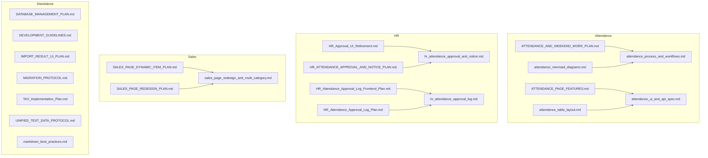

# Markdown Documentation Reorganization Plan

---

## Objective

Unify, declutter, and better organize the IcePlant Management Portal's Markdown documentation by merging overlapping files and grouping related content.

---

## 1. Attendance Documentation

### Merge into: `attendance_process_and_workflows.md`

- `ATTENDANCE_AND_WEEKEND_WORK_PLAN.md`
- `attendance_mermaid_diagrams.md`

*Content:* Unified attendance and weekend work process, approval workflows, all related diagrams.

---

### Merge into: `attendance_ui_and_api_spec.md`

- `ATTENDANCE_PAGE_FEATURES.md`
- `attendance_table_layout.md`

*Content:* Attendance UI features, API endpoints, table layouts, UI diagrams.

---

## 2. HR Documentation

### Merge into: `hr_attendance_approval_and_notice.md`

- `HR_Approval_UI_Refinement.md`
- `HR_ATTENDANCE_APPROVAL_AND_NOTICE_PLAN.md`

*Content:* HR approval workflows, UI behavior, notice mark feature, backend logic.

---

### Merge into: `hr_attendance_approval_log.md`

- `HR_Attendance_Approval_Log_Frontend_Plan.md`
- `HR_Attendance_Approval_Log_Plan.md`

*Content:* Approval/rejection audit trail, data model, API, frontend UI, export.

---

## 3. Sales Documentation

### Merge into: `sales_page_redesign_and_multi_category.md`

- `SALES_PAGE_DYNAMIC_ITEM_PLAN.md`
- `SALES_PAGE_REDESIGN_PLAN.md`

*Content:* Multi-category sales support, Iceplant vs. inventory sales, UI and backend changes.

---

## 4. Standalone Documents (keep as-is)

- `DATABASE_MANAGEMENT_PLAN.md`
- `DEVELOPMENT_GUIDELINES.md`
- `IMPORT_RESULT_UI_PLAN.md`
- `MIGRATION_PROTOCOL.md`
- `TAX_Implementation_Plan.md`
- `UNIFIED_TEST_DATA_PROTOCOL.md`
- `markdown_best_practices.md`

---

## Summary Diagram

---

## Next Steps

- Merge the identified files into unified documents as outlined.
- Update internal links and references accordingly.
- Remove obsolete/duplicate files after merging.
- Maintain this plan as a reference for future documentation organization.