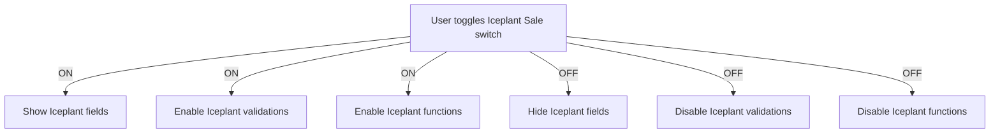

# Sales Page Redesign & Multi-Category Sales Plan

---

## Overview

This plan extends the existing Iceplant-focused Sales Page to support **multi-category sales**, including inventory items like steel, tools, and other materials. It also details the toggle logic, UI changes, backend updates, and validation rules.

_Last updated: April 10, 2025_

---

## 1. Sale Type Toggle

- Replace the current checkbox with a **button group**:
  - **Iceplant Sale**
  - **Inventory Sale**
- Default to Iceplant Sale.
- When toggled:
  - **Iceplant Sale:** show Iceplant-specific fields.
  - **Inventory Sale:** hide Iceplant fields, show inventory item selector.

---

## 2. Iceplant Sale Mode

- Show existing fields:
  - Pickup Quantity
  - Delivery Quantity
  - Price per Block
  - Brine Identifiers
- Enforce validation on these fields.
- Hide inventory item selection.

---

## 3. Inventory Sale Mode

- Hide all Iceplant-specific fields.
- Show a **dynamic list** of sale items:
  - Each item row has:
    - **Item selector** (dropdown/autocomplete) pulling from Inventory items **marked "For Sale"**
    - **Quantity**
    - **Unit Price** (auto-filled or editable)
    - **Remove** button
- Add a **"+" button** to add more items.
- Calculate total cost based on items.

---

## 4. Backend Changes

- Extend the Sale model or create a related **SaleItem** model:
  - `sale` (ForeignKey)
  - `inventory_item` (ForeignKey)
  - `quantity`
  - `unit_price`
  - `total_price`
- When saving an Inventory Sale:
  - Create a Sale record with `is_iceplant=False`.
  - Create related SaleItem records.

---

## 5. Inventory Integration

- Add a **"For Sale"** boolean flag to Inventory items.
- Filter inventory dropdown to only show items with this flag.
- Optionally, show stock levels.

---

## 6. UI Summary

| Feature                     | Iceplant Sale Mode                 | Inventory Sale Mode                     |
|-----------------------------|------------------------------------|----------------------------------------|
| Pickup/Delivery Quantities  | Visible & Required                 | Hidden                                 |
| Price per Block             | Visible & Required                 | Hidden                                 |
| Brine Identifiers           | Visible                            | Hidden                                 |
| Inventory Item Selector     | Hidden                             | Visible                                |
| Add Multiple Items          | No                                 | Yes (+ button)                        |
| Total Cost Calculation      | Based on quantities x price/block  | Sum of item quantities x unit prices   |

---

## 7. Implementation Steps

### Frontend

- Add Sale Type toggle button group.
- Conditionally render Iceplant or Inventory fields.
- Implement dynamic item list with add/remove.
- Fetch inventory items marked "For Sale".

### Backend

- Add `is_iceplant` boolean to Sale (already done).
- Create `SaleItem` model linked to Sale.
- Add "For Sale" flag to Inventory items.
- Update serializers and API endpoints.

### Validation

- Enforce required fields based on sale type.
- Calculate totals accordingly.

### Testing

- Test Iceplant sales.
- Test inventory sales with multiple items.
- Verify totals and data saved correctly.

---

## 8. Toggle Logic & Conditional Behavior

### Conditional UI rendering

```tsx
{formData.is_iceplant && (
  // Iceplant fields here
)}
```

### Conditional validation

- Enforce Iceplant-specific validations **only if** `formData.is_iceplant` is true.
- Skip these validations for regular sales.

### Conditional API payload

- Always send zero or omit Iceplant fields when `is_iceplant` is false.
- Backend should accept zero/default values for these fields in regular sales.

### Disable Iceplant-specific functions

```tsx
if (formData.is_iceplant) {
  // Iceplant-specific logic
}
```

### UI toggle behavior

- The "Iceplant Sale" toggle acts as a **mode switch**.
- When toggled ON, enable all Iceplant features.
- When toggled OFF, hide/disable all Iceplant features.

---

## 9. Mermaid Diagram: Toggle Logic



---

## 10. Summary

- The toggle **fully controls** the UI, validation, and logic.
- When OFF, the app behaves as a **regular inventory sale**.
- When ON, the app behaves as an **Iceplant sale** with all related features.
- This plan enables the Sales Page to support both Iceplant-specific sales and general inventory sales, with a clear toggle and dynamic UI, integrated with inventory data.